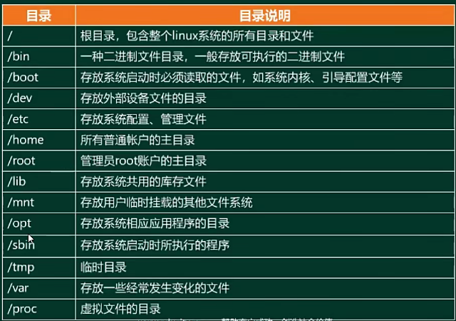
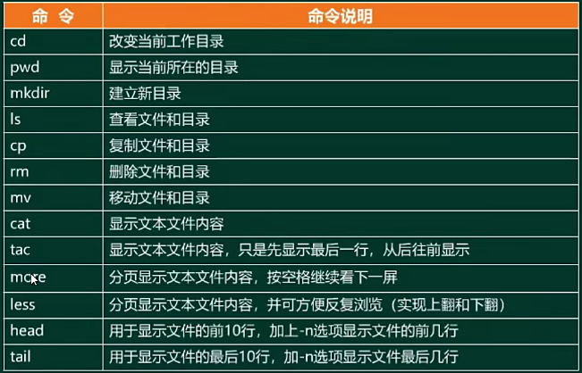
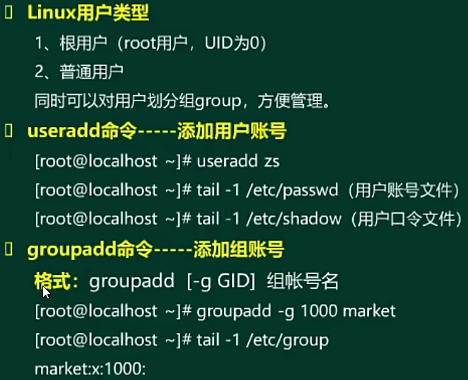
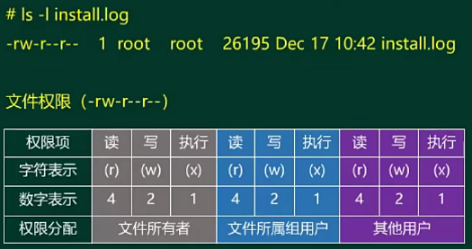
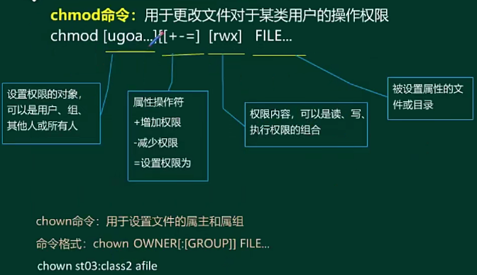
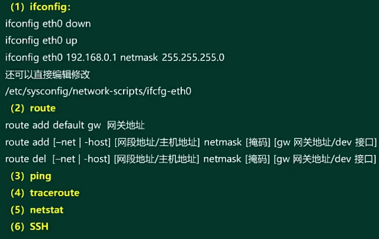

- [网络管理技术](#网络管理技术)
  - [整体情况](#整体情况)
  - [Windows基本管理 ⭐⭐⭐](#windows基本管理-)
  - [Linux基本管理 ⭐⭐⭐](#linux基本管理-)
  - [网络管理协议 ⭐⭐⭐](#网络管理协议-)
  - [网络存储 ⭐⭐](#网络存储-)

# 网络管理技术

## 整体情况

比较重要，出分也多

## Windows基本管理 ⭐⭐⭐

**网络配置命令**

```powershell
ipconfig 
# 显示本机TCP/IP配置的详细信息
ipconfig /all
# DCHP客户端手工释放IP地址
ipconfig /release
# DCHP客户端手工向服务器刷新请求
ipconfig /renew
# 清除本地dns缓存内容
ipconfig /flushdns
# 显示本地dns内容
ipconfig /displaydns

ping
# 持续ping，直到终止
ping -t 目标ip/域名
# 指定数据包大小（字节），默认是32B
ping -l 目标ip/域名
# ping的同时，解析目的主机名
ping -a 目标ip/域名
# 指定回显数据报的数目，默认是4个包
ping -n 目标ip/域名
# 指定TTL的值，xp默认是128，现在大多默认是64
ping -i 目标ip/域名

# 路由跟踪
tracert 目标ip/域名

# 显示通信线路上每个子网的延迟和丢包率（ping和tracert结合体）
pathping

netstat
# 显示所有连接和监听端口
netstat /a
# 显示按协议统计信息
netstat /s
# 显示以太网统计信息
netstat /e
# 显示路由表
netstat /r
# 以数字形式显示地址和端口号
netstat /n
# 显示与每个连接相关的所属进程ID
netstat /o

# 查看主机路由表命令，和netstat /r等价
route print

# 查询Internet域名信息或诊断DNS服务器问题的工具
nslookup
```

## Linux基本管理 ⭐⭐⭐

**Linux操作系统**

- 特点：
  - 源代码公开
  - 完全免费
  - 完全的多任务和多用户
  - 移植性好
  - 稳定性好
  - 用户界面良好
  - 强大的网络功能

**目录结构**



/proc 不是存放在磁盘中，是存放在内存当中的，是动态变化的，是进程状态信息

/lostfound 是当系统产生错误时，会把一些片段放在这个目录，系统恢复的时候会去该目录恢复，一般都是空的。

**常用命令**



ps 查看进程命令

kill pid 终止进程命令

关机命令：
- halt
- poweroff
- shutdown -h now
- init 0

重启命令：
- reboot
- shutdown -r
- init 6

init 1 代表进入单用户模式，init 3 代表进入多用户模式

**用户管理**



**用户权限**



-rw-r--r--，其中最高位 - 代表普通文件，d 代表是目录， c 代表是字符设备文件



**网络配置命令**



## 网络管理协议 ⭐⭐⭐

## 网络存储 ⭐⭐