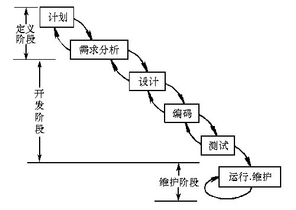
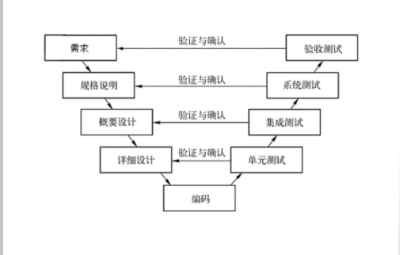
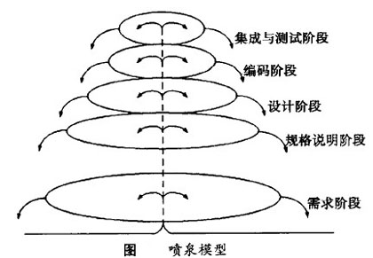
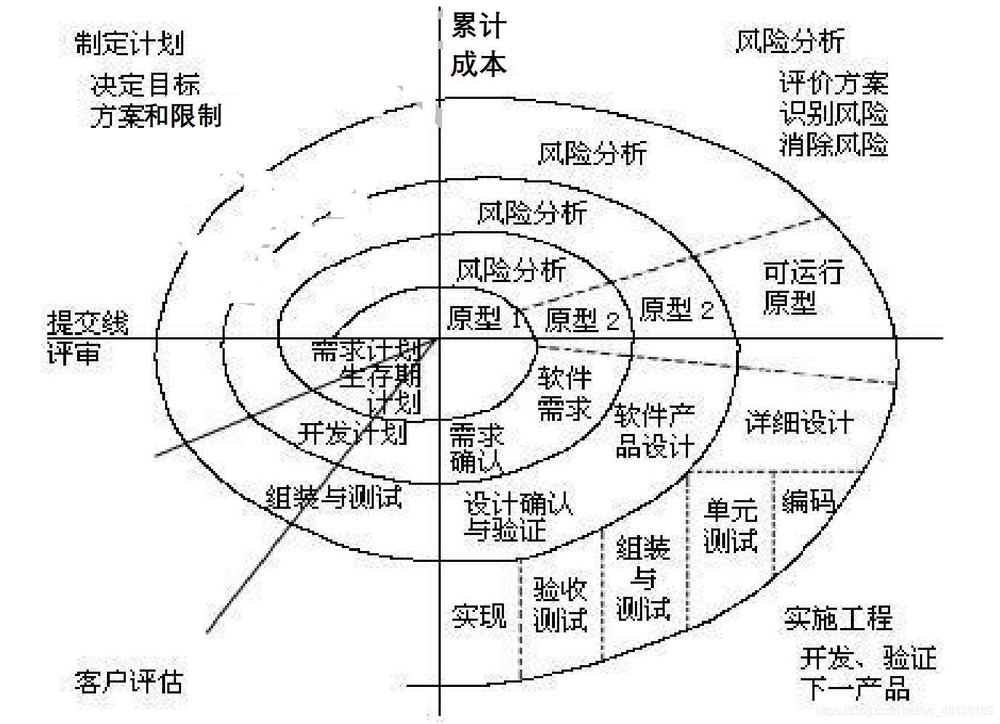

- [系统开发和项目管理基础](#系统开发和项目管理基础)
  - [整体情况](#整体情况)
  - [软件生命周期与开发模型 ⭐⭐⭐](#软件生命周期与开发模型-)
  - [软件设计 ⭐⭐](#软件设计-)
  - [软件测试 ⭐](#软件测试-)
  - [项目管理基础 ⭐⭐⭐](#项目管理基础-)
- [知识产权与标准化](#知识产权与标准化)
  - [整体情况](#整体情况-1)
  - [知识产权 ⭐⭐⭐](#知识产权-)
  - [标准化 ⭐](#标准化-)

# 系统开发和项目管理基础

## 整体情况

不是考试重点章节，简要介绍。

## 软件生命周期与开发模型 ⭐⭐⭐

软件生命周期：
- 计划时期
  - 问题定义：开发的功能到底是什么
  - 可行性分析：可行性分析文档
- 开发时期
  - 需求分析：需求分析文档
  - 总体设计：软件的框架设计
  - 详细设计：各个功能部分如何来实现
  - 编码
  - 测试
- 运行时期
  - 维护：纠错性维护和改动性维护。

**开发模型**
- 瀑布模型
  - 最早的一个模型，适用情况：
  - 需求是非常明确的，在后期需求不会发生变化
  - 可提供成功的模板，利用之前的模板经验开发新的项目

- V模型
  - 工作中的错误只有到测试阶段才会被发现

- 喷泉模型
  - 主要是面向对象的开发模型
  - 在各个开发阶段是可相互重叠，无间隙
  - 各个阶段的工作可相互迭代

以下三个模型适合需求不明确的开发项目：

- 原型化模型
  - 是瀑布模型的改进模型
  - 快速构建一个原型，去和客户进行交互，获得需求
  - 适合需求会发生变化的情况
  - 会抛弃原型

- 演化模型
  - 会保留原型
  - 会根据用户基本需求开发出原型
  - 之后在用户需求变动后继续在原型上完善开发

- 增量模型
  - 会保留原型
  - 和客户沟通后，接下来的功能，通过增量包的方式完善产品

螺旋模型
- 特点：
  - 加入了其他模型都没有的风险分析，可在早期发现风险
  - 适合大型昂贵的项目，对风险要求比较高的开发项目
  - 适合大规模团队开发的项目

## 软件设计 ⭐⭐

划分软件系统模块时应做到高内聚、低耦合。
- 各个模块之间彼此之间是紧密联系的，代码相关性很强；
- 模块和模块之间要相互独立；

## 软件测试 ⭐

主要分为：
- 动态测试
  - 运行程序测试
  - 黑盒测试
    - 主要是功能性测试
    - 定义一个输入，是否正确产生输出
  - 白盒测试
    - 又称逻辑驱动测试、路径测试、结构测试
    - 看内部代码实现，是否高效
    - 对测试人员开发能力要求高
  - 灰盒测试
- 静态测试
  - 不运行产品程序，从软件开发文档查看有没有相应错误

测试分类：
- 单元测试
  - 模块接口、、局部数据结构、边界条件、独立路径、错误处理
- 集成测试
  - 模块间的接口和通信
- 系统测试
  - 恢复测试、安全性测试、强度测试、性能测试、可靠性测试和安装测试
- 验收测试
  - 有效性测试、软件配置审查、验收测试

每次开发人员修复后，需要回归验证测试

## 项目管理基础 ⭐⭐⭐
涉及九大知识领域：
- 范围管理
- 时间管理
  - 主要关注时间
  - 辅助时间管理的图：
    - 甘特图
      - 不能体现各个任务的依赖关系
    - PERT图
      - 完成任务的最大值的路径为关键路径
      - 关键路径上的节点任务不能被推迟，其他节点可被推迟
- 成本管理
- 质量管理
- 人力资源管理
- 沟通管理
- 风险管理
- 采购管理
- 整体管理

# 知识产权与标准化

## 整体情况

送分题，大概 1 分

## 知识产权 ⭐⭐⭐

**内容提要**
- 从所涉及的法律法规角度
  - 《中华人民共和国著作权法》
  - 《计算机软件保护条例》
  - 《中华人民共和国商标法》
  - 《中华人民共和国专利法》
  - 《中华人民共和国反不正当竞争法》
- 知识产权角度
  - 著作权及邻接权
  - 专利权
  - 工业品外观设计权
  - 商标权
  - 地理标志权
  - 集成电路布图设计权
- 从考题考点分布角度
  - 保护期限
    - 作品和软件，50年
    - 商标 10年
    - 发明专利 20年
    - 实用新型 10年
    - 商业秘密，不确定，公开就不是秘密了
  - 知识产权人确定
  - 侵权判断

## 标准化 ⭐
很多年不考了

分类：
- 国际标准
  - ISO、IEC等国际标准化组织
- 国家标准
  - GB-中国、ANSI-美国、BS-英国、JIS-日本
- 区域标准
  - 又称为地区标准，如PASC-太平洋地区标准会议、CEN-欧洲标准委员会、ASAC-亚洲标准咨询委员会、ARSO-非洲地区标准化组织
- 行业标准
  - GJB-中国军用标准、MIT-S-美国军用标准、IEEE-美国电气电子工程师协会
- 地方标准
  - 国家的地方一级行政机构制定的标准
- 企业标准
- 项目规范

标准代号的识别：
- 国际、国外标准代号：标准代号+专业类号+顺序号+年代号
- 我国国家标准代号：强制性标准代号为GB、推荐性标准代号为GB/T、指导性标准代号为GB/Z、实物标准代号为GSB
- 行业标准代号：由汉语拼音大写字母组成（如电子行业为SJ）
- 地方标准代号：由DB加上省级行政区域代码的前两位
- 企业标准代号：由Q加上企业代号组成