- [数据通信基础](#数据通信基础)
  - [信道特性 ⭐⭐⭐](#信道特性-)
  - [数字编码与编码效率 ⭐⭐⭐](#数字编码与编码效率-)
  - [脉冲编码调制 ⭐⭐⭐](#脉冲编码调制-)
  - [复用技术 ⭐⭐](#复用技术-)
  - [差错控制 ⭐⭐⭐](#差错控制-)

# 数据通信基础

## 信道特性 ⭐⭐⭐
数据通信系统的模型

通信术语：
- 信息
- 数据
- 信号
  - 模拟信号（受噪声影响大，不适合长距离传输）
  - 数字信号（时间上是不连续的，适合长距离传输，现在广泛使用）
- 码元

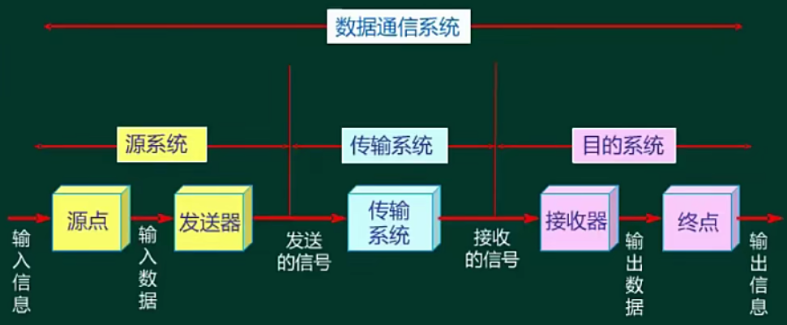

发送器将二进制流数据转换成模拟信号或者数字信号的过程，叫调制过程

接收器接收到信号后，要进行解调，转换成终端可处理的二进制数据流。

由于数据是双向传输，发送器和接收器都要进行调制和解调，也叫调制解调器。

信道传输都是有噪声影响的，实际的传输速率可用香农公式计算，理想的传输速率用奈奎斯特定理来计算。具体计算公式如下图：

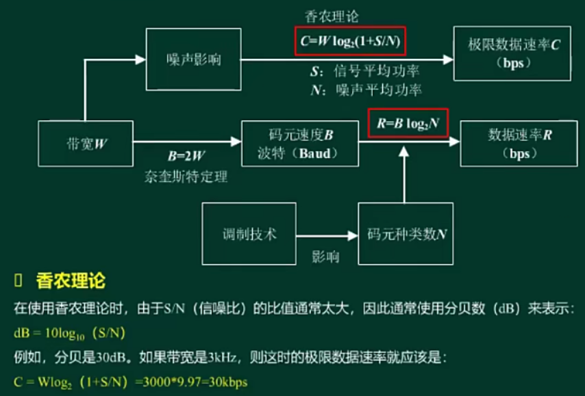

**调制技术-模拟信道传送数字数据**

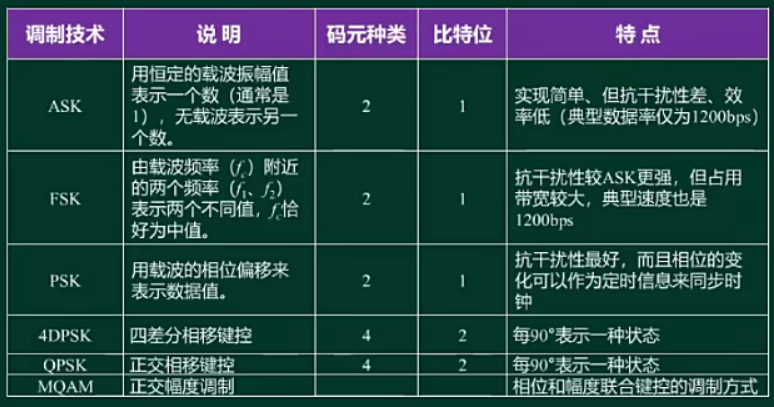

**编码技术-数字信道传送模拟数据**

PCM脉冲编码调制技术
- 采样（奈奎斯特采样定律：采样频率应大于模拟信号的最高频率的2倍）（得到样本）
- 量化（分类）（获得不同类型的值，也叫离散值的个数）
- 编码

## 数字编码与编码效率 ⭐⭐⭐

- 基本编码

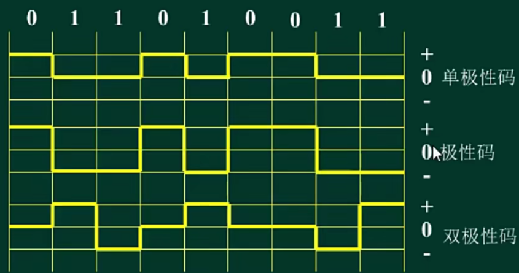

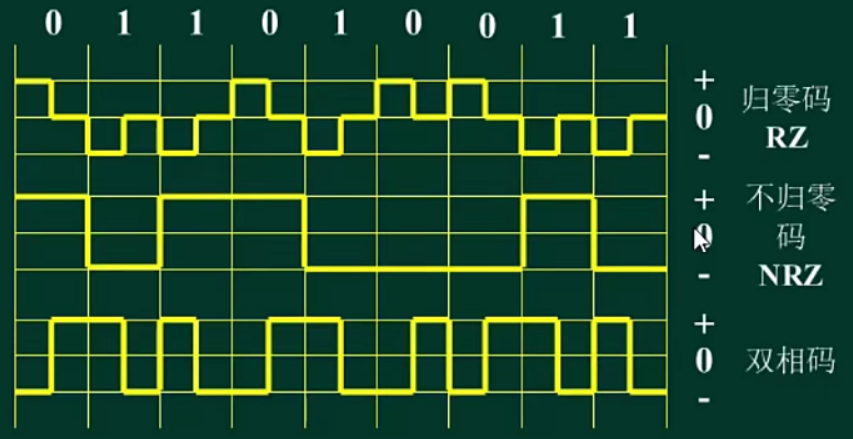

- 应用性编码

曼切斯特编码常用于 10M 以太网，差分曼切斯特编码常用于令牌环网。其编码效率只有 50%
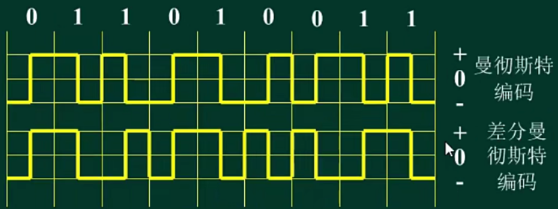

- 编码效率

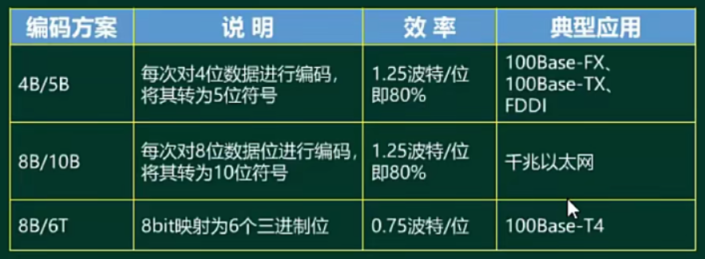

## 脉冲编码调制 ⭐⭐⭐

## 复用技术 ⭐⭐

- 空分复用（SDM）
  - 光缆
- 频分复用（FDM）
  - 收音机
- 时分复用（TDM）
  - 同步时分：用户始终占用时间片，信道利用率不高。
  - 异步时分，实现时间片的精准分配，谁传输谁使用。
- 波分复用（WDM）
  - 用在光纤中
- 码分复用（CDMA）
  - 码序列来区分

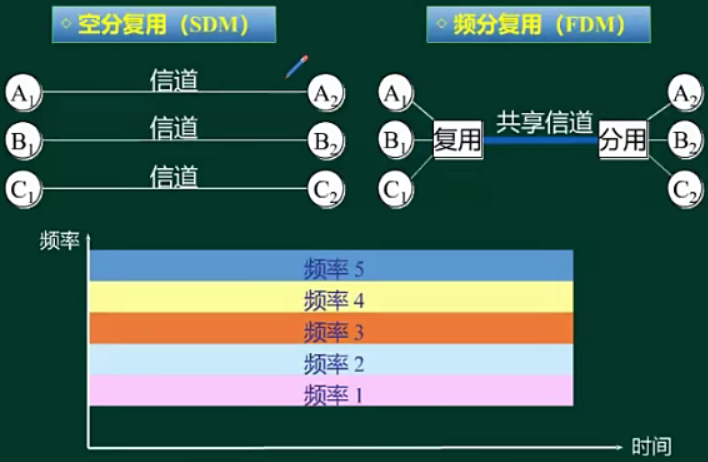

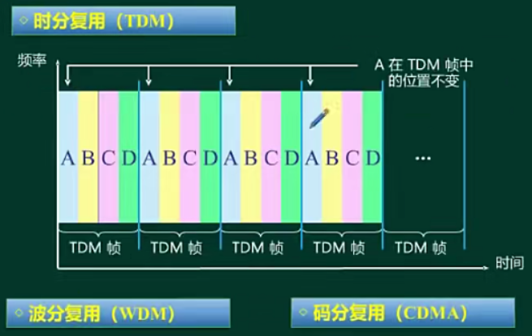

**常见复用标准**

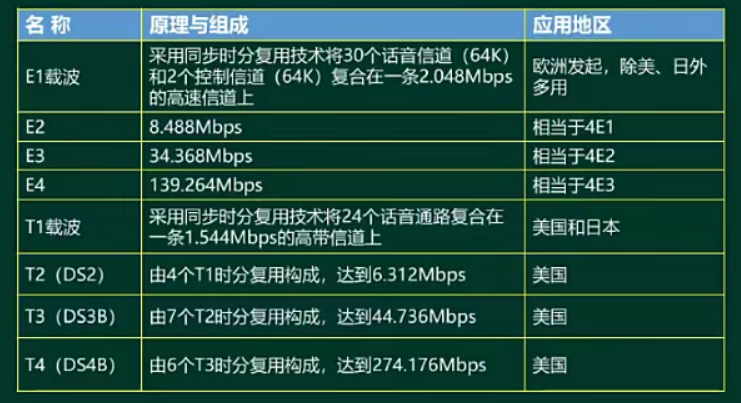

**通信方式**

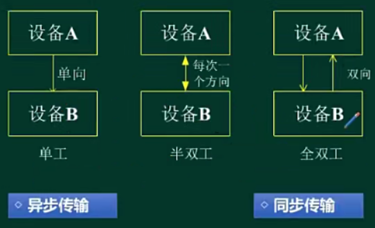

同步传输（以数据块为单位）的意思是接收方能够正确的识别和接收发送方的消息，开销小；

异步传输（以字符为单位）的意思是要在传输的数据前后加入起始字符和终止字符，算作额外的开销，传输数据越大，额外开销越多。

并行通信：一次同时可以发送多少位的二进制数据

串行通信：一次只传输一个比特的数据，适合长距离传输，路由器和路由器之间通过串行通信，用串口传输。

## 差错控制 ⭐⭐⭐

对收到的信息进行检查，看是否正确，若错误的话可进行纠正，就是检错和纠错。

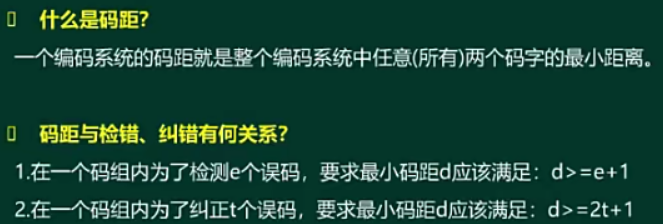

> 奇偶校验：

只能检测出一些随机性的错误，有局限性。

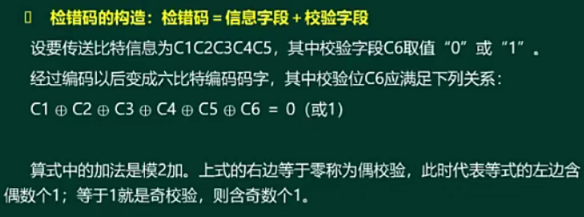

> 海明校验

可检测错误，并纠正一位错误，通常用在主存储器上。

m: 数据位的位数

k: 冗余位（海明码）的位数

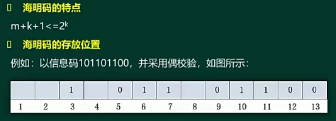

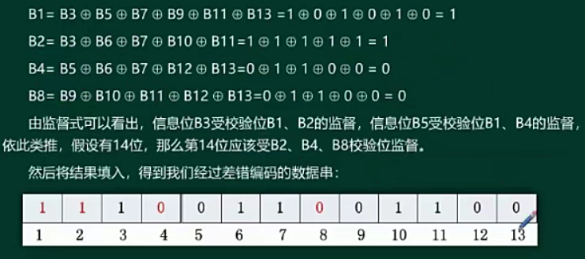

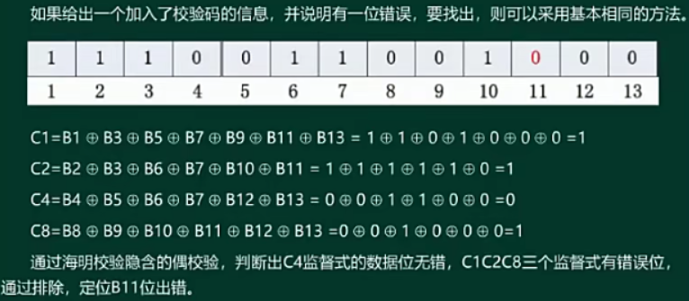

> CRC（循环冗余）校验

可以纠错，但开销太大，不进行纠错，直接会把数据丢弃，给发送发一个重发请求。

1、冗余位数=生成多项式的最高次幂

2、除数由生成多项式得到

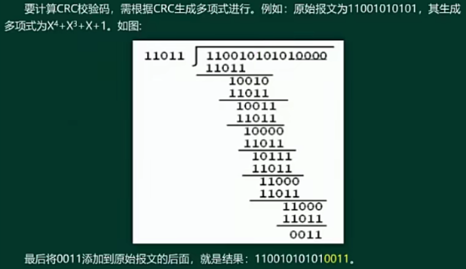

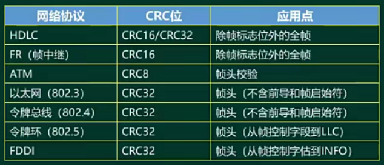