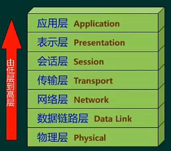
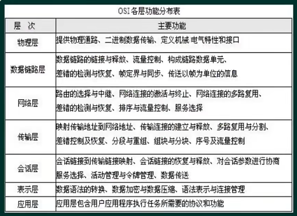
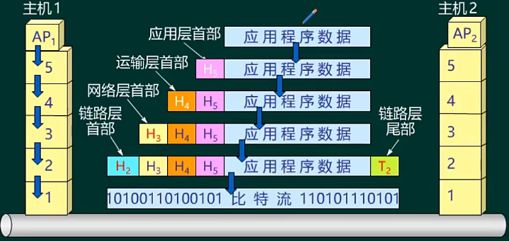
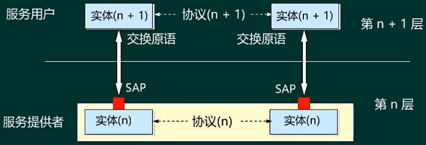
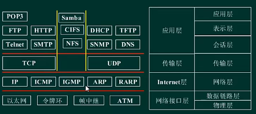

- [网络体系结构](#网络体系结构)
  - [整体情况](#整体情况)
  - [计算机网络概念 ⭐](#计算机网络概念-)
  - [OSI 参考模型 ⭐⭐⭐](#osi-参考模型-)
  - [TCP/IP 体系结构 ⭐⭐](#tcpip-体系结构-)

# 网络体系结构

## 整体情况

单独考的话不会特别难，占比不高，大概2-3分，是后续章节基础。

## 计算机网络概念 ⭐

计算机网络定义为“以能够相互共享资源的方式互连起来的自治计算机系统的集合”，主要表现为：
- 目的是实现计算机资源的共享
- 分布在不同地理位置的多台独立的“自治计算机”
- 通信必须遵循共同的网络协议

计算机网络的性能：
- 速率
  - 单位时间内能够传输的数据量
  - bps（比特每秒）
- 带宽
  - 信道所能承受的最大的传输速率
  - bps
- 吞吐率
  - 计算机网络的综合性能，单位时间内整个计算机网络的通信量
  - bps
- 时延
  - 发送时延 = 数据帧长度 / 信道带宽
  - 传播时延 = 信道长度 / 电磁波在信道上的传播速率
    - 电缆介质为 200 km/ms = 200 m/us, 具体的延迟时间与两地之间距离有关系
    - 卫星信号的传播时延固定为 270ms
  - 处理时延
  - 排队时延
- 往返时间
- 利用率

网络协议：
- 为网络数据交换而制定的规则、约定和标准成为网络协议
- 语法、语义和时序为三大要素

## OSI 参考模型 ⭐⭐⭐

主要作为理论参考来进行，实际使用的是 TCP/IP 标准

- 物理层：透明的传送二进制比特流，传送单位为比特 bit
- 数据链路层：使得物理层传输更可靠，传送单位为帧，设备为交换机/网桥
- 网络层：实现网络路由的选择，传送单位为包，设备为路由器/三层交换机
- 传输层：能够实现端到端传输，通过端口号确定，传送单位为数据段；
- 会话层：管理两个会话之间的连接；
- 表示层：使得应用层交付的数据能够在网络中传输，翻译作用；
- 应用层：把应用进程封装成用户数据；

**数据的封装与解封装**

**服务访问点**

垂直方向来看，下一层要为上一层提供服务。

- 数据链路层的服务访问点（SAP）： LLC地址
- 网络层的服务访问点（SAP）： IP地址
- 传输层层的服务访问点（SAP）： 端口号

## TCP/IP 体系结构 ⭐⭐

OSI 和 TCP/IP 对应关系，以及常用协议

