- [局域网技术](#局域网技术)
  - [整体介绍](#整体介绍)
  - [局域网定义 ⭐](#局域网定义-)
  - [IEEE 802标准 ⭐⭐](#ieee-802标准-)
  - [以太网技术 ⭐⭐⭐](#以太网技术-)
  - [虚拟局域网(VLAN) ⭐⭐⭐](#虚拟局域网vlan-)
  - [TRUNK、VTP、GVRP ⭐⭐⭐](#trunkvtpgvrp-)
  - [生成树STP协议 ⭐⭐⭐](#生成树stp协议-)
  - [无线局域网（WLAN） ⭐⭐⭐](#无线局域网wlan-)
  - [综合布线系统 ⭐⭐](#综合布线系统-)

# 局域网技术

## 整体介绍

局域网，简称为LAN，覆盖范围比较小，主要涉及数据链路层和物理层，不会涉及到路由。

比较重要的章节。

## 局域网定义 ⭐

指有限区域（如办公室或楼层）内的多台计算机通过传输介质互连，所组成的封闭网络，实现数据通信和资源共享的目的。

常用传输介质：双绞线、同轴电缆、光纤、无线等。

常见拓扑形状：总线型、星型、环形。

## IEEE 802标准 ⭐⭐

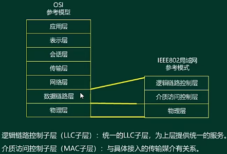

**逻辑链路控制子层-服务类型**

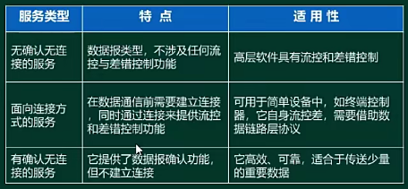

**介质访问控制子层**

各种介质的访问控制技术的特征由两个因素来区分：
- 在哪里控制
  - 集中式（由一台设备来控制）
  - 分布式（各终端子集控制）
- 怎样控制
  - 同步式
  - 异步式

异步式的方式，重点关注竞争式：
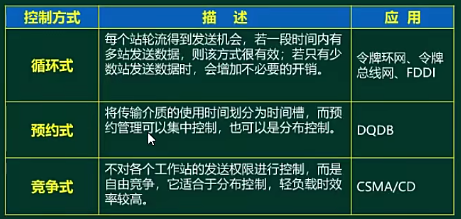

在mac子层采用的介质访问控制协议使用的是CSMA/CD协议（局域网中采用的协议）。

**标准**

主要关注：
- 802.1A
- 802.3
- 802.11

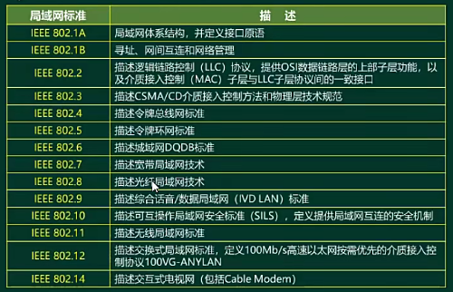

## 以太网技术 ⭐⭐⭐

**CSMA/CD协议**

共享的以太网会有冲突，冲突发生时信道利用率不高，浪费信道带宽，需要有一个协议降低冲突概率。

对应 IEEE 802.3标准，属于竞争型协议。

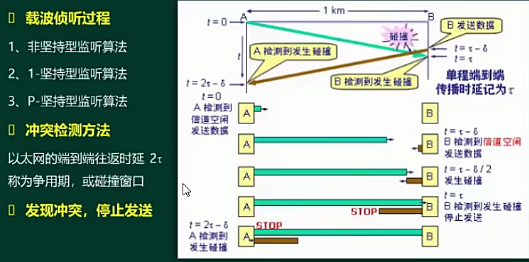

- 载波侦听过程（CSMA过程）
  - 监听信道是否空闲，只有信道是空闲时，才会发送数据。
  - 非坚持型监听算法：
    - 监听到信道是空闲的，立即发送数据；
    - 信道忙时，随机后退一个时间，再监听信道状态。
    - 特性：信道利用率不高，可能随机后退的时间过长，导致信道空闲。
  - 1-坚持型监听算法（100%监听）
    - 监听到信道是空闲的，立即发送数据；
    - 信道忙时，继续监听信道；
    - 特性：信道利用率高，冲突概率稍微高；
  - P-坚持型监听算法
    - 监听到信道是空闲的，以概率 P 发送数据；
    - 信道忙时，持续监听信道；
    - 特性：平衡了冲突和抢占信道的关系，P 的取值很关键。

- 冲突检测过程（CD过程）
  - 边发边听，发送数据的时候以帧为单位，一个比特一个比特的发送，听收到的信息和发出去的信息一样不，一样的话就没有冲突，不一样的话就有冲突（冲突会影响信号）。
  - 2倍的传播时延之后，就可以确定不会发生冲突了，2t也叫争用期或者碰撞窗口。
  - 要求发送时延 >= 2t，也就是在发送时就能够检测到冲突。
  - 最短帧长 >= 2 * 传播时延 * 带宽

- 若发现冲突, 停止发送.
- 之后随机延迟重发, 算法如下.

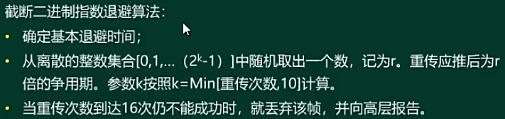
基本退避时间 = 2 * 传播时延

**MAC地址**

前3个字节是分配给厂商的, 叫做组织唯一标识符;
后3个字节, 叫做扩展标识符.

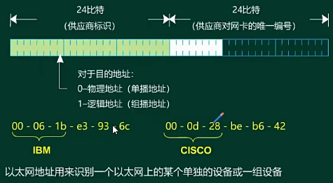

**以太网帧格式**

MAC 帧包含5各部分:
- 目的地址和源地址都是mac地址, 各占6个字节
- 类型用于描述上层对应的协议, 占2个字节
- 数据字段
- FCS字段, 校验字段, 占4个字节, 采用CRC-32位校验

在每发送一个 MAC 帧之前, 还有8个字节, 用于同步作用, 叫前导字段.

合法的数据部分长度为46-1500字节, 1500也是数据部分的MTU(最大传输单元), 合法的帧长为64-1518字节(IEEE 标准), 若数据部分的字节不满46字节, 进行0填充, 数据大于1500字节时, 会进行分片.

无效帧:
- 不在合法的帧长范围内
- 最后的CRC校验, 校验出错, 也认为是无效帧, 并让发送方重传
- 取出的帧结构不是字节为单位的二进制比特流

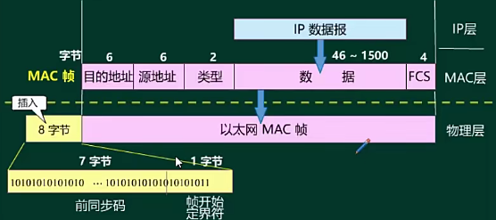

**网络传输介质**

- 无屏蔽双绞线 UTP
  - 三类UTP，10M，简称CAT3
  - 四类UTP，和三类差不多，所以未广泛使用，简称CAT4
  - 五类UTP，也就是网线，100M，简称CAT5，里面有8根线，但其实用到的只有4根往下
  - 超五类UTP，1000M，简称CAT5E
  - 六类UTP，1000M，简称CAT6
- 屏蔽双绞线 STP
  - 多了一个屏蔽层，相对UTP抗干扰性，传输质量要好

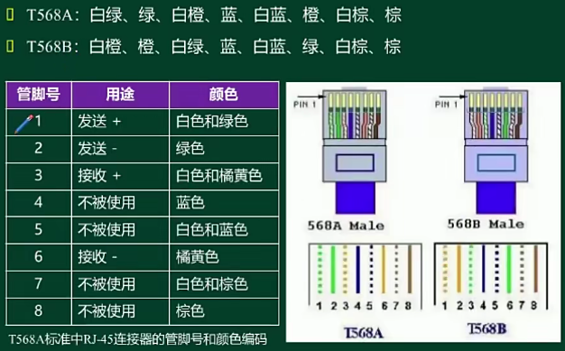
其实只有1、2、3、6真正进行通信。

根据两个标准，理论上有直通线和交叉线之分，但现在实际上都是用的直通线：

直通线指网线两头都是按照T568标准接线，主要用于连接两种不同类型的设备（路由器和交换机，交换机和主机）

交叉线指一头是T568A，一头是T568B标准，主要用于连接同类型设备。

- 同轴电缆
  - 电视网络最常见的介质
- 光纤
  - 用于主干道中，保证数据长距离传输，内部传输的是光信号，所以传输时需要先将电信号转换为光信号。
  - 多模光纤
    - 纤芯直径比较大，允许光信号以不同入射角进入进行全反射；
    - 在进行传递时，损耗较大，因而传输距离稍微短，但是也比双绞线距离长；
    - 可传输长波长信号和短波长信号；
    - 传输千兆大约550M，传输百兆大约2KM；
    - 光信号的产生可由LED二极管产生作为光源；
    - 现在多模更贵是因为少。
  - 单模光纤
    - 纤芯直径非常小，只允许一种方式进入进行全反射，类似一种直线传输方式；
    - 受到的干扰、噪声都比较小，可靠性比多模光纤要好，损耗也会更小，传输距离长，距离可达上百几十公里；
    - 只能传输长波长的信号；
    - 光信号只能由激光器LD产生对应光源，因而一般情况下，单模光纤成本要比多模高，会贵一点。
 
**快速以太网技术**

传统以太网传输速率是10Mbps;

快速以太网（百兆）特点，对应标准为IEEE 802.3u：
- 技术特点：
  - 速率可达100Mbps
  - 相同的帧格式
  - 半双工/全双工通信
- 传输介质标准：
  - 100Base-TX，2对五类UTP，全双工系统，传输距离最大100M
  - 100Base-FX，光纤传输，全双工系统，可用单模或者多模，传输距离同光纤特点；
  - 100Base-T4，4对三类UTP，要用到CSMA/CD冲突检测，传输距离最大100M；

千兆以太网特点，对应标准为IEEE 802.3z：
- 技术特点：
  - 速率可达1000Mbps
  - 相同的帧格式
  - 半双工/全双工通信 
- 传输介质标准：
  - 1000Base-T，4对UTP，全双工系统，传输距离最大100M
  - 1000Base-SX，短波长光信号，用多模光纤，最大距离550M；
  - 1000Base-LX，长波长光信号，可用单模或多模光纤，传输距离同光纤特点；
  - 1000Base-C4，2对STP，传输距离最大25M，交换机之间短距离相连；

万兆以太网特点，对应标准为IEEE 802.3ae：
- 技术特点：
  - 速率可达10000Mbps
  - 相同的帧格式
  - 全双工通信（光纤）
- 传输介质标准：
  - 局域网物理层
  - 可选的广域网物理层

**冲突域和广播域**

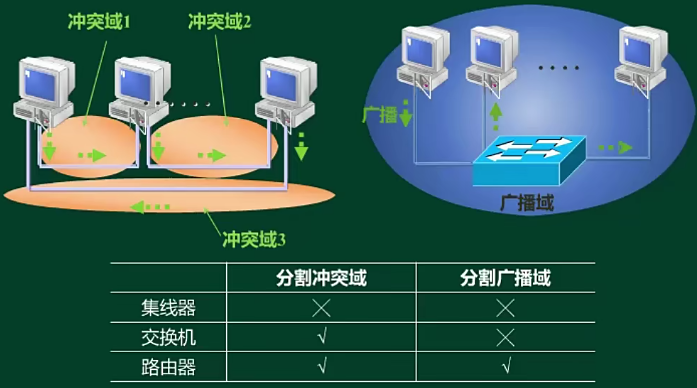

冲突域，是一层（物理层）概念，物理层的设备不能分割冲突域；

广播域，是二层（数据链路层）的概念，一个局域网就是一个广播域，主要指广播帧，在这个域中会发送给所有的设备，二层设备就不能分割广播域，但可以分割冲突域，分割广播域需要由网络层设备（路由器）来处理；

交换机的每个接口都是冲突域，路由器的每个接口都是广播域；

**交换式以太网**

前面讲的都是共享型的以太网，容易产生冲突，因而产生了交换式以太网，主要是因为交换机的出现，这个时候设备都通过交换机连接；

交换机转发：
- 未知单播帧，进行泛洪，发送给其余所有端口；
- 已知单播帧，根据MAC地址表进行转发；
- 广播帧，转发给所有端口。

现在交换机厂商大部分都是默认为碎片丢弃的转发策略。

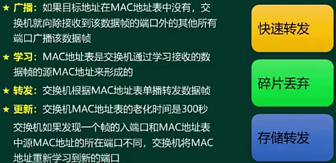

**堆叠和级联**

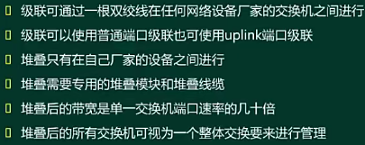

## 虚拟局域网(VLAN) ⭐⭐⭐

一个局域网就是一个广播域，理想方式是使用路由器来划分广播域，但是硬件成本高，在这里划分不太合适，就有VLAN产生了；

利用交换机实现的虚拟局域网（VLAN），每个VLAN是一个广播域，二层的数据帧只会在对应VLAN中转发，不属于同一个VLAN时，就会向上层处理了；

VLAN划分方法：
- 静态VLAN（基于交换机端口划分）
- 动态VLAN
  - 基于MAC，适用于移动办公
  - 基于网络协议
  - 基于IP组播
  - 基于策略
  - 基于用户定义

数据帧泛洪时，只会在相同的VLNA中泛洪，其他VLAN区域。

**VLAN编号规则**

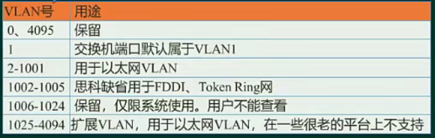

**以太网端口类型**

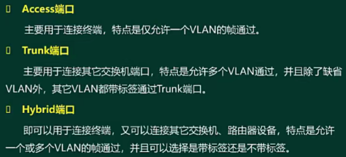

华为交换机默认是hybrid端口，不带标签；

## TRUNK、VTP、GVRP ⭐⭐⭐

**TRUNK封装协议**

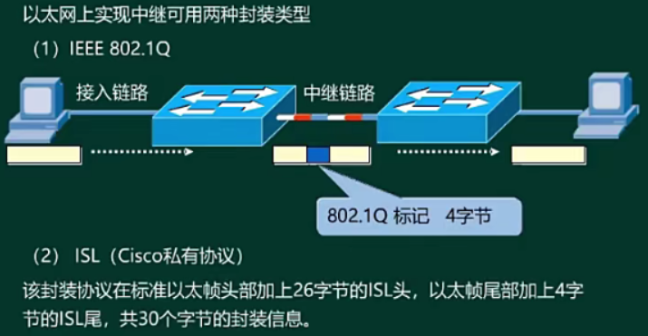

802.1Q 标记的4字节中有12位指明属于哪个vlan。

思科只有access和trunk两种端口。

**VLAN中继协议-VTP（思科私有）**

其他厂商也可能支持；

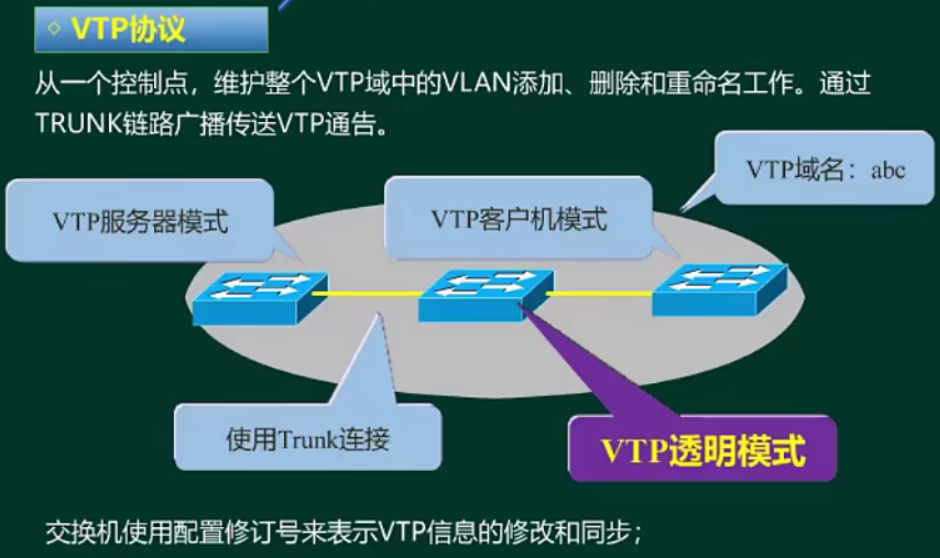

vtp服务器模式的设备既可以影响别的设备，也可以被别的设备所修改，思科交换机默认是服务器模式；

vtp客户机模式，不能在自己设备上设置vlan，只能同步其他设备的vlan信息；

vtp透明模式，可以传递vlan信息，也可以自己配置，相当于独立的，不会被其他设备影响，也不会影响别人；

VTP修剪，在服务器模式的交换机上配置即可：
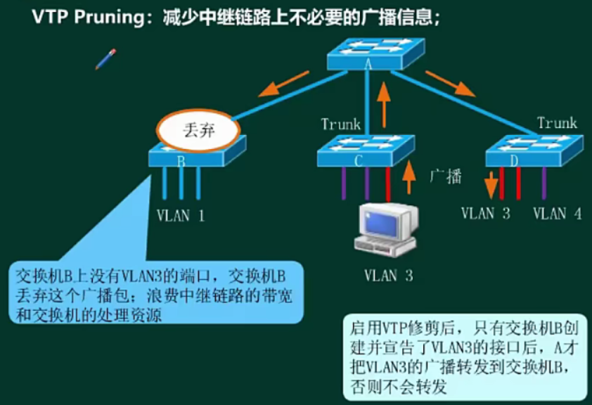

**GARP协议**

主要有两种用途：
- GVRP：传递vlan信息
- GMRP：传递组播信息

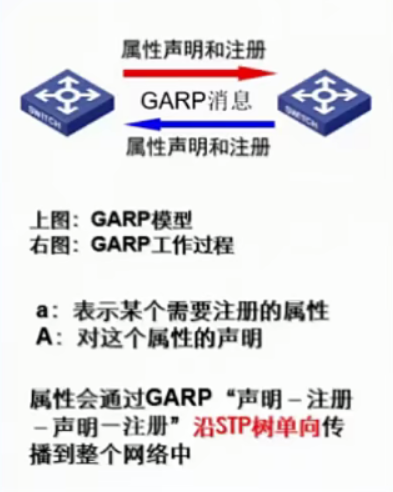

**VLAN注册协议-GVRP协议**

对应的标准为802.1p

定义的是端口模式
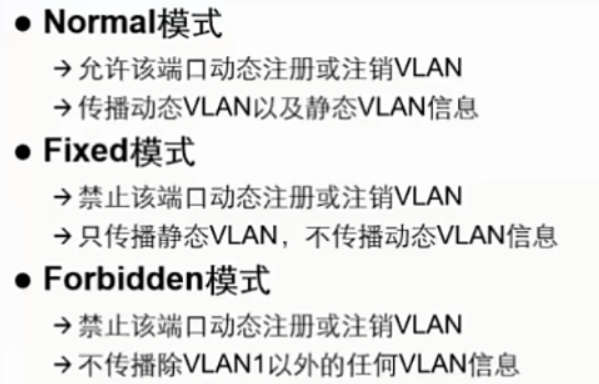

动态VLAN：通过gvrp动态学习到的vlan

静态VLAN：在设备上配置的vlan

设备端口默认是Normal模式，也是最常用的模式。

## 生成树STP协议 ⭐⭐⭐

原始的STP协议标准为 IEEE802.1D;

升级的RSTP（快速生成树协议）标准为 IEEE802.1W;

多生成树协议（MSTP）标准为 IEEE802.1S。

对网络的可靠性要求较高，通常使用冗余方式保证可靠：
- 添加冗余设备
- 添加冗余链路

冗余后会形成环路，因为网络中对广播帧和未知的单播帧会发送到其余所有的端口，会出现广播风暴，同时还有交换机的mac地址表不稳定震荡，生成树协议就是解决这个问题的。

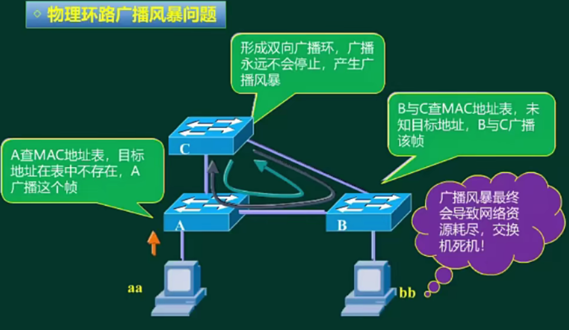

**STP协议功能**

逻辑上断开链路，防止广播风暴的产生；

当线路出现故障，断开的接口被激活，恢复通信，起备份线路的作用；

**STP协议算法**

STP利用BPDU（桥协议数据单元，所需要的信息都在这里，BID，PID，开销等等）选择根网桥，计算路径成本；

计算过程如下：

- 选择根网桥（交换机）

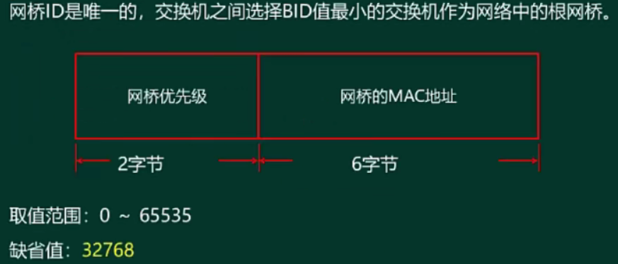

网桥优先级由2个字节（16位）组成，只有前4位是优先级信息，后面12位都是vlan信息，所以调整网桥优先级时必须是4096的倍数，否则不成功。

选择根网桥时，先比较网桥优先级，若都一样，则比较mac地址；

- 选择根端口

在非根网桥上选择一个到根网桥最近的端口作为根端口

选择根端口的依据：选择根网桥；本端口到根网桥路径成本最低（带宽越大，开销越小）；直连的网桥ID最小；直连端口ID最小。

- 选择指定端口

在每个网段上，选择1个指定端口路径成本最低；

根桥上的端口全都是指定端口；

非根桥上的指定端口：
 
1. 本端口所在网桥到根网桥路径成本最低
2. 本端口所在网桥的ID值较小
3. 本端口ID值较小

选择好指定端口后，其余端口就是阻塞端口。

以上整个计算过程被成为**生成树协议的收敛**，在这个收敛过程中，网桥的端口会变化，主要有5种状态：

1. 转发（Forwarding），可转发数据流量，学习mac地址
2. 学习（Learning），不转发数据流量，学习mac地址，保持15s
3. 侦听（Listening），不转发数据流量，不学习mac地址，保持15s
4. 阻塞（Blocking），逻辑上阻塞，不会转发数据流量，BPDU还是会转发，会维持20s时间
5. 禁用（Disabled），端口是down掉的，不会转发任何数据

收敛时间要50s，时间太长了。

**RSTP-快速生成树协议**

RSTP端口角色增加：

1. 根端口、指定端口和边缘端口（用于连接主机）
2. 替代端口、备份端口（都属于阻塞端口）

RSTP端口状态（简化）：

1. 丢弃、学习、转发

**以太网通道**

将多条物理链路捆绑从一条逻辑链路，但也不是无限制捆绑，最多捆绑8条。
就是端口聚合。

配置方法：
1. 管理员手动配置
2. 通过配置对应协议：
   1. PAGP
   2. LACP

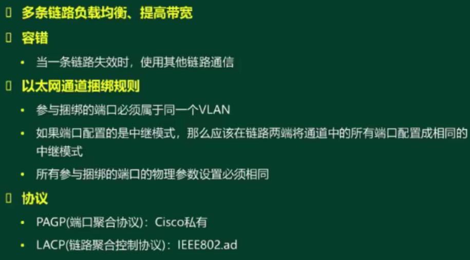

## 无线局域网（WLAN） ⭐⭐⭐

利用射频技术将无线电波传送；

缺点是：网络性能差，不稳定，速率比较低，安全性低；

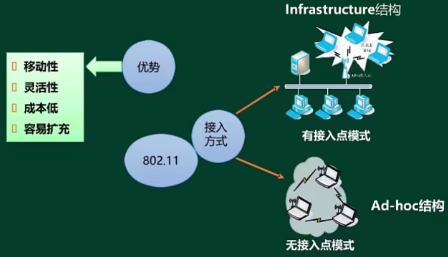

有接入点模式有AP（无线接入点，将有线网络信号转换为无线信号，无线交换机，无线路由器），无接入点模式没有。

无接入点模式，就是利用自己的无线网卡实现互相连接，不能上网，在局域网种可通信。

**WALN标准**

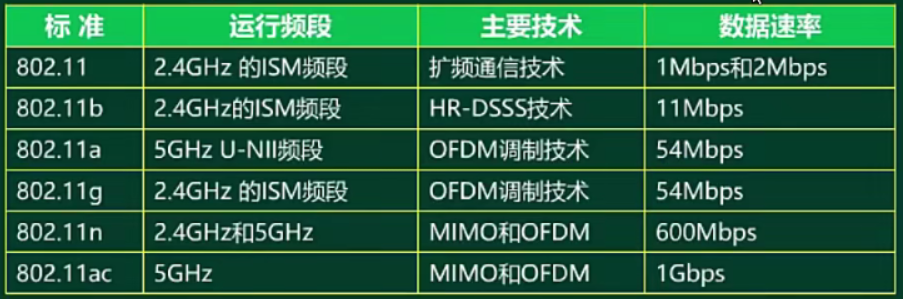

**IEEE 802.311 MAC层协议**

不是使用CSMA/CD，因为存在以下问题：

- 隐蔽站问题

A 检测不到 C，C也检测不到A，会导致冲突，就是隐蔽站问题。

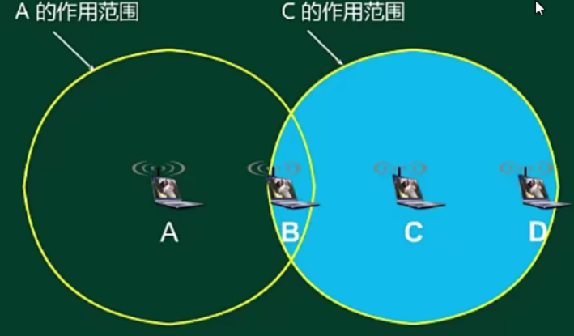

- 暴露站问题

C给D发送数据和B给C发送数据是互相不干扰的，但冲突检测到是忙，所以就不发送，是暴露站问题。

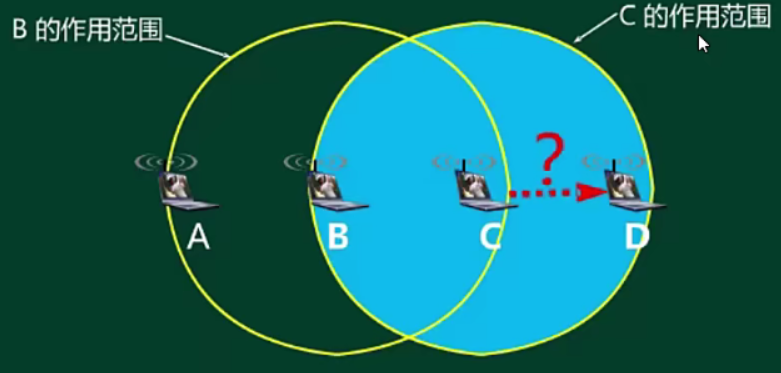

因而，无线局域网使用的是改进的CSMA协议，改进的办法是把CSMA增加一个碰撞避免功能。

IEEE 802.11就使用 CSMA/CA协议，在使用 CSMA/CA协议同时，增加使用停止等待协议。

**WLAN安全性**

- 更改默认设置
- 更新AP的Fireware
- 屏蔽SSID广播（搜索不到无线信号，可手动输入连接）
- 加密和认证
  - 加密方式
    - WEP（有限等效加密，对称加密，RC4算法） < WPA（WEP的升级版，增加认证机制，加密算法也是RC4架构） < WPA2（比WPA在加密上面增强，使用AES加密）
- MAC地址过滤

## 综合布线系统 ⭐⭐

掌握六大子系统的定义：
- 工作区子系统，插网线地方到终端的地方，这个范围是工作区；
- 水平子系统，（配线架、配线电缆等，一般都是沿着楼层走线，所以叫水平子系统）
- 管理子系统，（弱电井，每个楼层一般都有一个管理子系统）
- 干线子系统，（各个楼层子系统到设备间的走线，连接各个楼层，从上到下，也叫垂直子系统）
- 设备间子系统，（一栋楼一般有一个或多个，也就是机房，里面有很多重要设备，管理员值班的地方）
- 建筑群子系统，（楼栋与楼栋之间的连接，一般都是在户外，也叫户外子系统）

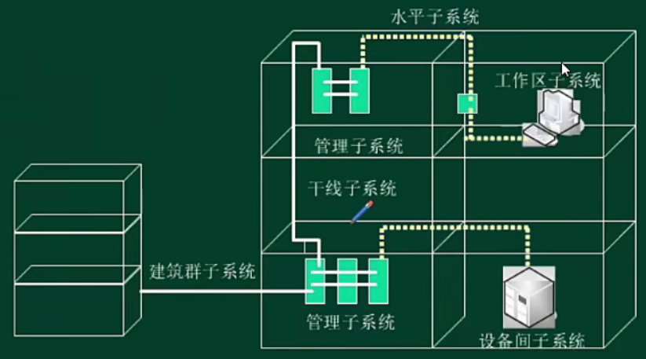