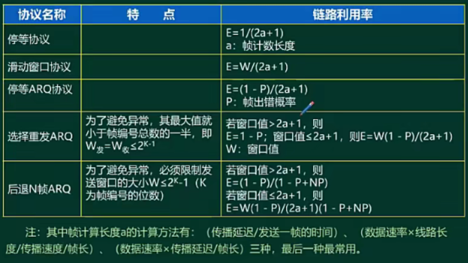
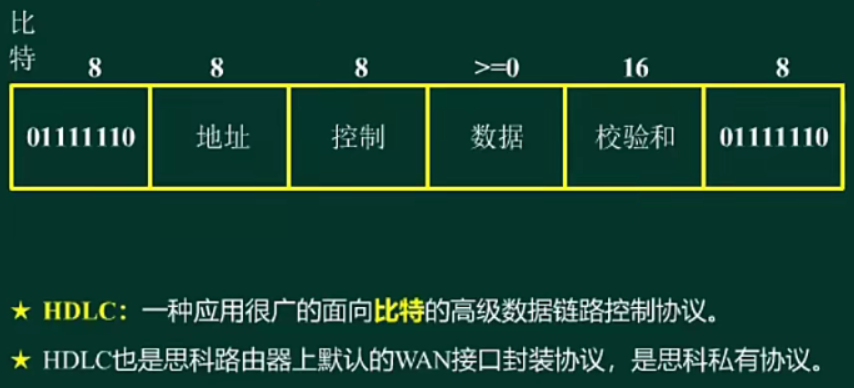
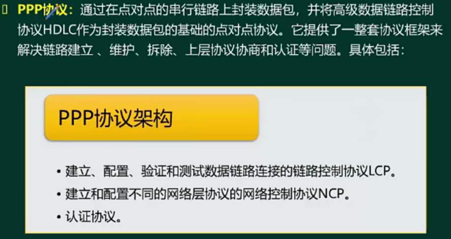
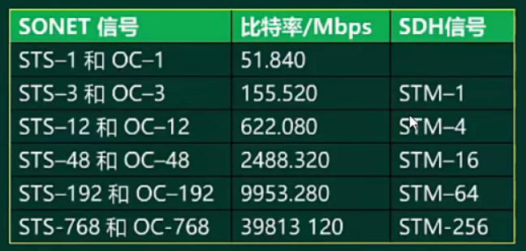
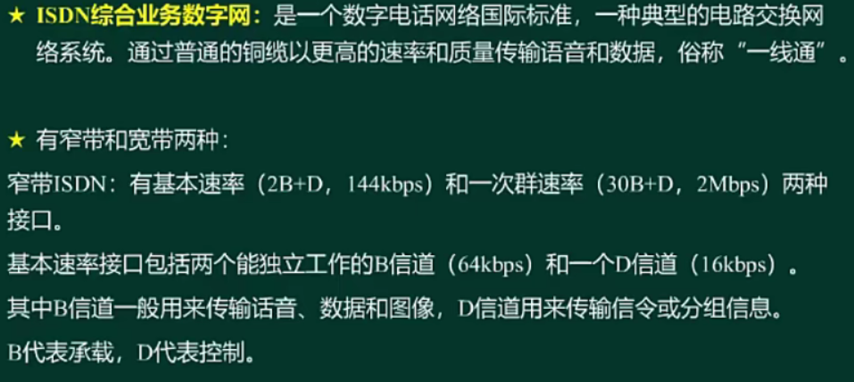
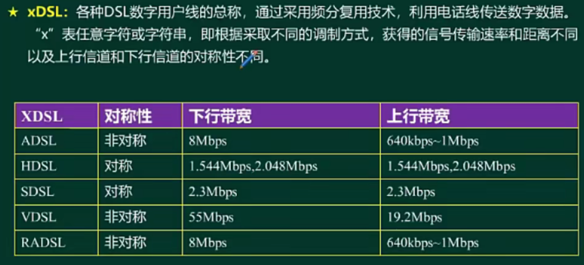
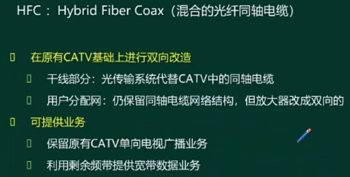
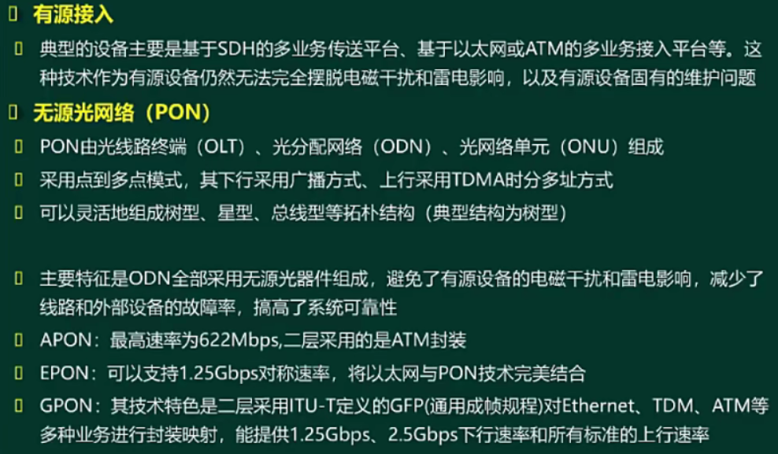

- [广域网与接入网技术](#广域网与接入网技术)
  - [整体介绍](#整体介绍)
  - [广域网交换方式 ⭐⭐](#广域网交换方式-)
  - [流量控制和差错控制 ⭐⭐⭐](#流量控制和差错控制-)
  - [HDLC ⭐](#hdlc-)
  - [PPP ⭐](#ppp-)
  - [SONET/SDH ⭐⭐⭐](#sonetsdh-)
  - [xDSL ⭐⭐⭐](#xdsl-)
  - [HFC ⭐](#hfc-)
  - [光纤接入-FTTx ⭐⭐](#光纤接入-fttx-)

# 广域网与接入网技术

## 整体介绍
局域网涉及的是物理层和数据链路层内容，本章要涉及网络层内容。

## 广域网交换方式 ⭐⭐

**广域网基本概念**

覆盖较大地理范围的数据通信网络，使用网络提供商和电信公司所提供的传输设施传输数据，对用户都是透明的。

**交换方式**

两种方式：专线（扯单独的线路，实现物理的永久的点对点连接）和交换连接（使用电信公司组建的网络进行数据传输），交换连接主要分为：

- 电路交换（电话网络PSTN，实时性高，面向连接的通信方式，没有提供可靠性的方案）
- 报文交换（采用存储转发模式，保证可靠性，延迟最大，提供流量控制和差错控制）
- 分组交换（传输分组，速度更快）
  - 数据报（IP数据报方式，面向无连接，尽最大努力的交付方式，现在使用的因特网）
  - 虚电路（面向连接的传输方式，是共享的连接）
  - 信元交换（传输长度固定的分组，面向连接，可以快速处理和交换，典型应用为ATM网络）

**常见广域网协议**

- X.25，通过在第三场建立虚电路，提供流量控制和差错控制，实现可靠交付
- 帧中继，在第二层建立虚电路，只做检测，不重传，适合突发性业务。
- ATM，面向连接方式，将数据分割成固定长度的信元（53B），典型速率为155Mbps。

## 流量控制和差错控制 ⭐⭐⭐

在数据链路层进行的机制，不要和后面搞混了。

流量控制：控制发送方发送速率太快，接收方来不及处理。

理解以下两个ARQ的发送窗口大小，是为了让后续的接收发能够确认是上一次重传的数据帧。

选择重发ARQ，只会对出错的帧重发，后面的利用率不会考。

后退N帧ARQ，会重发出错的帧以及后面的帧。

## HDLC ⭐

是数据链路层的协议。

## PPP ⭐

面向字符的协议，常见的应用是拨号上网PPPoE；

PPP验证方式：
- 密码验证协议PAP
  - 携带明文用户名密码进行认证，不安全
  - 两次握手完成认证
  - 只认证一次
- 挑战式握手验证协议CHAP
  - md5-hash值，对比hash值
  - 三次握手
  - 可认证多次

## SONET/SDH ⭐⭐⭐

是两个标准，掌握下表内容；

电信号是STS、光信号是OC、SDH也是光信号

## xDSL ⭐⭐⭐

ISDN这个不怎么用了已经；

xDSL需要学习；

目前最常用是ADSL。

表中主要关注名称和对称性。

## HFC ⭐

利用频分复用技术。

## 光纤接入-FTTx ⭐⭐

