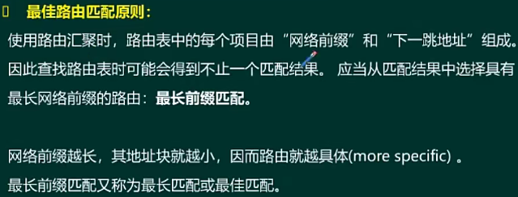

- [因特网与网络互联技术](#因特网与网络互联技术)
  - [整体介绍](#整体介绍)
  - [网络层](#网络层)
    - [IP地址分类 ⭐⭐⭐](#ip地址分类-)
    - [IP分配与子网划分 ⭐⭐⭐](#ip分配与子网划分-)
    - [无分类编址CIDR ⭐⭐⭐](#无分类编址cidr-)
    - [IP数据报 ⭐⭐⭐](#ip数据报-)
    - [ARP与ICMP协议 ⭐⭐⭐](#arp与icmp协议-)
    - [IPv6协议 ⭐⭐⭐](#ipv6协议-)
  - [传输层](#传输层)
    - [TCP与UDP ⭐⭐⭐](#tcp与udp-)
  - [应用层](#应用层)
    - [域名系统 ⭐⭐⭐](#域名系统-)
    - [文件传输服务 ⭐⭐⭐](#文件传输服务-)
    - [远程登录服务 ⭐⭐](#远程登录服务-)
    - [动态地址分配服务 ⭐⭐⭐](#动态地址分配服务-)
    - [电子邮件服务 ⭐⭐](#电子邮件服务-)

# 因特网与网络互联技术

## 整体介绍

在局域网中已经接触过物理层和数据链路层，该章节会接触到网络层、传输层和应用层。

## 网络层

网络层最主要的功能就是路由的选择，依据IP地址寻址。

**IP协议以及配套协议**


### IP地址分类 ⭐⭐⭐

**IP地址表示方式**


网络位 + 主机位组成的表示


> A类

网络位最高位为0，取值范围为1-126，其中0和127不取，主机可取为2^24-2，全0和全1不取，全0就是表示网络地址，全1为广播地址；

> D类

特殊的组播地址，路由协议用的比较多；

**特殊的IP地址**


> 单播是点对点

> 组播和广播是点对多点

> 全1的广播地址，路由器不会转发，网络号+主机号全1，也叫直接广播地址，路由器会转发。

### IP分配与子网划分 ⭐⭐⭐

从主机号截取了子网号，出现三级IP地址。


求子网掩码时，网络号取1（子网号也是网络号），主机号取0。

IP地址与子网掩码进行与操作可得到网络号。


### 无分类编址CIDR ⭐⭐⭐

主要是网络位相同的划分到网络位，不同的都划分到主机位。





### IP数据报 ⭐⭐⭐

主要关注首部，首部固定部分为20字节，可变部分为0-40字节，因而首部取值范围为20-60字节。


- 版本，v4和v6
- 首部长度，占4位，取值为5-15
- 总长度，代表IP数据报总长度
- 标识，分片的标识
- 标志，3位，一个保留，后面有DF和MF，DF代表不允许分片，若分片时DF取0，MF表示还有更多分片，MF=1表示后面还有分片，MF=0表示是最后一个分片。
- 片偏移，该分片在原始报文中所对应的相对位置，分片的时候是只对数据部分分片，片偏移存储时除以8存储。
- 生存时间，数据包在网络中转发寿命，时间到的时候还没到目的地就会被丢弃，现在改为了跳数，为256跳。

**分片的IP数据报**

分片之后的各个数据报的首部内容和原来的首部不同。


### ARP与ICMP协议 ⭐⭐⭐

**ARP协议**

ARP地址解析协议，实现IP->MAC地址的解析。

数据报在网路的转发过程中，MAC地址会一直发生变化，因为经过不同路由器的转发。

ARP协议广播进行ARP请求，单播进行ARP响应。


ARP欺骗：攻击者发送ARP单播响应给主机A，将目的地址都改为攻击者地址，因为ARP表项动态更新，那么原来发送给B的数据都会发送给攻击者。

为了避免ARP欺骗，可以添加静态的ARP条目，静态的条目比动态优先级高；

```bash
# 查看ARP缓存表
arp -a 
# 清楚ARP缓存
arp -d
# ARP静态绑定
arp -s ip-address mac-address
```

**ICMP协议**

主要是提高IP数据报在网络中能够交付成功的一种机制，若出现问题，及时报告给发送方，但不解决问题。

报文如下：


应用：
- Ping命令
- Traceroute（Linux）、Tracert（Windows）命令（路由跟踪）

### IPv6协议 ⭐⭐⭐


ipv4是固定40个字节的首部


**地址类型**

IPv6单播
- 可聚合的全球单播地址（相当于ipv4公网地址）
  - 最高位为001
- 本地单播地址
  - 链路本地
    - FE80开头:: （定义前10位）
  - 站点本地（类似v4中的私有地址）
    - FEC0开头::（定义前10位）

ipv6地址中接口标识符可解析出MAC地址，因而不需要ARP协议解析。


链路本地地址


组播（多播）地址


任播地址


**过渡方案**


**服务质量Qos**


综合服务模型不适合广泛使用的，适合小范围使用；

区分服务模型用的比较多。

## 传输层

实现端口到端口的服务。

### TCP与UDP ⭐⭐⭐

**UDP（用户数据报协议）**

特点：
- 无连接
- 尽最大努力交付
- 面向报文
- 支持一对一、一对多、多对一和多对多
- 首部开销小
- 一有报文就交付，延迟低，传输效率高
- 不提供拥塞控制

端口号为2字节，也就是16位，所以端口范围为65535


**TCP**

特点：
- 面向连接的传输层协议
- 每一条TCP连接只有2个端点，可靠性交付
- 可靠交付
- 全双工通信
- 面向字节流

> 面向字节流


> TCP报文

- 也是有20字节固定首部
- 序号，报文的seq
- 确认号，ack的值，期待接受的下一个的确认号
- 数据偏移，tcp首部的长度
- 控制位：
  - URG：紧急控制位，等于1代表有紧急数据传送，紧急指针会指向要紧急传送的数据
  - ACK：确认信号，等于1时，上方的确认号才会起作用，代表是响应报文，告诉对方期待接收的下一个报文
  - PSH：推送位，等于1时，发送发立即发送数据，不需要等待
  - RST：复位位（重启位），等于1时，告诉对方连接有问题，需要重新建立连接
  - SYN：同步位，等于1时，代表正在建立TCP连接，建立过程中置为1，完成后可以为0
  - FIN：终止位，等于1时，说明收到后需要断开TCP连接
- 窗口，进行流量控制的字段，代表接收方空闲的缓冲窗口多少个。


> 三次握手建立连接


只经过两次握手，有什么问题？

A 发送第一次连接请求时，可能会有连接延迟，有可能延迟较大，超过A的计时器，倒计时结束时还没有收到B的响应时，认为报文丢了，会再次重发一次连接请求。若在重发的时候，B对原先请求的报文进行了确认，接着又收到了新的连接请求，就会有异常。三次握手时，A知道B第一次确认的报文已经被认定为失效报文，可以忽略，就不会建立双向连接，能够保证始终只有一条双向连接。

断开连接是是四次挥手，A没有数据传输时，发送FIN请求，B进行确认，B没有数据传输时，发送FIN请求，A进行确认。

> 流量控制

使用的是可变大小的滑动窗口机制


> 传输层端口

三类端口
- 熟知端口：0-1023
- 登记端口：1024-49151
- 客户端口号：49152-65535

分为两类端口的话，分为低位端口和高位端口（>1024）


DHCP、DNS、TFTP、DHCP、SNMP都是基于UDP的，其他基于TCP。

## 应用层

### 域名系统 ⭐⭐⭐

名称解析方法：
- Host表
- DNS系统

域名系统DNS：实现将域名和IP进行映射，并提供解析的分布式数据库服务，使得人们能更加方便的访问互联网。

**层次型结构的域名空间（树形）**


**域名服务器**

全球有13台根域名服务器，只有1台在亚洲，其他大部分都在美国。


**域名解析**

客户端DNS解析顺序：
- 先查看客户端的DNS缓存，若有直接返回
- 查找host文件
- 找本地DNS服务器（客户端配置了DNS服务器）

DNS查询：
- 本地解析
  - 查找区域配置文件，看是否有ip和域名对应关系
  - 查找本地缓存
  - 寻求互联网DNS服务器查找
- 迭代解析

被请求方只回应给请求方其所知道的信息。

迭代解析会比递归解析要好一些，递归查找会增大根域名服务器的压力。


- 递归解析


**对象类型与资源记录**


DNS在传输层使用UDP协议，端口号为53

### 文件传输服务 ⭐⭐⭐

传输层基于TCP协议实现，建立两个TCP连接，一个控制连接，端口为21，一个数据连接，端口号为20。


ftp文件传输有两种模式（控制进程都是21，会影响数据端口号）：
- 主动模式
  - 控制连接时，客户端会告诉服务器自身的数据端口号
  - 服务器主动用20端口连接客户端的数据端口
  - 客户端主机通常都是企业内部主机，一般都会有防火墙，会阻止外部连接，因而不能进行数据传输
- 被动模式
  - 控制连接时，服务器会告诉客户端自身的数据端口号（一般都是高位端口）
  - 客户端可以用自己的端口连接服务器的数据端口，


### 远程登录服务 ⭐⭐

本地客户端可远程登录到服务器进行管理；

传输层基于TCP协议实现，端口为23；


### 动态地址分配服务 ⭐⭐⭐

实现自动分配ip地址。

在传输层使用的是UDP协议，端口号有两个，客户端使用68，服务端使用67。

实现方式：
- 配置一台DHCP服务器
- 在路由器上配置DHCP拂去


广播发送dpcpdiscover请求，发送请求时源IP地址为0.0.0.0，目的IP为255.255.255.255。

若有多个DHCP服务器，则客户端先收到谁的DHCP offer报文就先使用谁的ip。

dhcprequest报文也是广播报文，告诉所有DHCP服务器，其选择了哪个ip。

客户端确认ip之后，也会进行下检测，如果ip冲突，则会发送dhcpdecline拒绝报文。

DHCP服务器是windows主机的话，租约默认是8天，如果是华为路由器提供，默认为1天。

进行dhcp discover时，如果没有服务器响应请求，会自动重试4次，若4次全都失败，客户端操作系统会自动给主机分配一个专有保留地址（169.254.0.0/16）。后面每5分钟还会发送dhcp请求。


**DHCP中继代理**

通过DHCP中继代理，可以使得客户端与服务器即使不在同一个网段，也可以获取IP地址。

中继代理将客户端的DHCP广播请求，转发单播请求给DHCP服务器。


### 电子邮件服务 ⭐⭐

主要关注，发送邮件的SMTP协议和读取邮件的POP3协议，这两个协议在传输层都是依靠TCP协议，端口号为25和110。


扩展：MIME（多用途互联网邮件扩展协议），可以使得邮件内容更加丰富，可包含音视频等文件的交互。