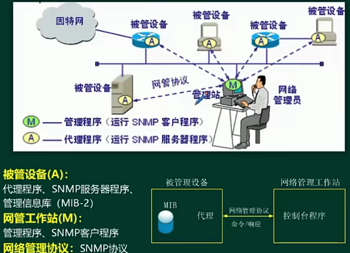

- [网络管理技术](#网络管理技术)
  - [整体情况](#整体情况)
  - [Windows基本管理 ⭐⭐⭐](#windows基本管理-)
  - [Linux基本管理 ⭐⭐⭐](#linux基本管理-)
  - [简单网络管理协议（SNMP） ⭐⭐⭐](#简单网络管理协议snmp-)
  - [网络存储 ⭐⭐](#网络存储-)

# 网络管理技术

## 整体情况

比较重要，出分也多

## Windows基本管理 ⭐⭐⭐

**网络配置命令**

```powershell
ipconfig 
# 显示本机TCP/IP配置的详细信息
ipconfig /all
# DCHP客户端手工释放IP地址
ipconfig /release
# DCHP客户端手工向服务器刷新请求
ipconfig /renew
# 清除本地dns缓存内容
ipconfig /flushdns
# 显示本地dns内容
ipconfig /displaydns

ping
# 持续ping，直到终止
ping -t 目标ip/域名
# 指定数据包大小（字节），默认是32B
ping -l 目标ip/域名
# ping的同时，解析目的主机名
ping -a 目标ip/域名
# 指定回显数据报的数目，默认是4个包
ping -n 目标ip/域名
# 指定TTL的值，xp默认是128，现在大多默认是64
ping -i 目标ip/域名

# 路由跟踪
tracert 目标ip/域名

# 显示通信线路上每个子网的延迟和丢包率（ping和tracert结合体）
pathping

netstat
# 显示所有连接和监听端口
netstat /a
# 显示按协议统计信息
netstat /s
# 显示以太网统计信息
netstat /e
# 显示路由表
netstat /r
# 以数字形式显示地址和端口号
netstat /n
# 显示与每个连接相关的所属进程ID
netstat /o

# 查看主机路由表命令，和netstat /r等价
route print

# 查询Internet域名信息或诊断DNS服务器问题的工具
nslookup
```

## Linux基本管理 ⭐⭐⭐

**Linux操作系统**

- 特点：
  - 源代码公开
  - 完全免费
  - 完全的多任务和多用户
  - 移植性好
  - 稳定性好
  - 用户界面良好
  - 强大的网络功能

**目录结构**


/proc 不是存放在磁盘中，是存放在内存当中的，是动态变化的，是进程状态信息

/lostfound 是当系统产生错误时，会把一些片段放在这个目录，系统恢复的时候会去该目录恢复，一般都是空的。

**常用命令**


ps 查看进程命令

kill pid 终止进程命令

关机命令：
- halt
- poweroff
- shutdown -h now
- init 0

重启命令：
- reboot
- shutdown -r
- init 6

init 1 代表进入单用户模式，init 3 代表进入多用户模式

**用户管理**


**用户权限**


-rw-r--r--，其中最高位 - 代表普通文件，d 代表是目录， c 代表是字符设备文件


**网络配置命令**


## 简单网络管理协议（SNMP） ⭐⭐⭐

网络管理五大管理功能：
- 配置管理
  - 对网络中设备进行配置的功能
- 故障管理
  - 故障信息分析
- 性能管理
  - 对网路性能监控
- 计费管理
  - 对网络中用户计费管理
- 安全管理




传输层采用的UDP协议；

各版本特点：
- v1，身份认证特别简单，通过团体名认证，团体名一致则可管理。
- v2，安全方面没有增强，没有广泛应用
- v3，在安全方面提升，互相称为SNMP实体，有权限管理即可管理，不再验证团体名

**工作过程**

指令：
- GET，获取被管设备信息，读取执行
- SET，操作/设置被管设备

被管设备（服务器端）161端口，接收get指令和set指令；

管理设备（客户端）162端口，接收Trap报文。

SNMP会周期性轮询被管设备信息。

被管理设备出问题时，Trap报文能够主动发出管理站。


## 网络存储 ⭐⭐

- 直连式存储（DAS）
  - 存储设备直接挂在服务器上，可扩展性有限
- 网络附加存储（NAS）
  - 专用存储服务器，用IP网络读取，数据使用效率高
  - 文件级调用，大数据级别（需要块级调用）不太友好
  - 受到网络带宽影响，安全性受限
- 存储区网络（SAN）
  - FC SAN
    - 光纤通道，传输性能高，支持块级调用
    - 成本较高，技术较复杂
- IP SAN（ISCSI）
  - NAS和FC SAN的结合
  - 不用光纤通道，使用以太网交换机
  - 支持块级调用（支持大数据存储）

