- [网络安全技术](#网络安全技术)
  - [网络安全概述 ⭐](#网络安全概述-)
  - [计算机病毒 ⭐⭐⭐](#计算机病毒-)
  - [加密技术 ⭐⭐⭐](#加密技术-)
  - [数字签名和报文摘要 ⭐⭐⭐](#数字签名和报文摘要-)
  - [密钥的分配 ⭐⭐](#密钥的分配-)
  - [防火墙技术 ⭐⭐⭐](#防火墙技术-)
  - [入侵检测和入侵防御（IDS和IPS）技术 ⭐⭐⭐](#入侵检测和入侵防御ids和ips技术-)

# 网络安全技术

## 网络安全概述 ⭐

网络安全五大基本要素：
- 机密性
- 完整性
- 可用性
- 可控性
- 可审查性

网络攻击（根据是否直接影响源站和目的站的通信内容区分）：
- 被动攻击
- 主动攻击
  - 重放攻击：攻击者使用之前正常的报文给目的站发送（经常出现在认证过程中（可以加时间戳））
  - Dos攻击：大量发送报文给目的站，消耗目的主机资源，使得目的主机不能正常完成服务。DDos是Dos的增强版（联合其他肉鸡一起给目的站发送攻击）。

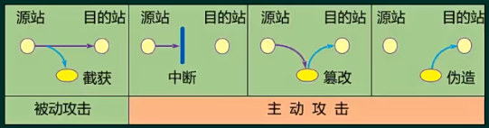

## 计算机病毒 ⭐⭐⭐

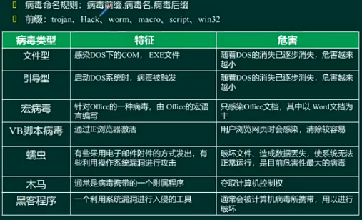

对应图中前缀的病毒类型：
- 木马病毒
- 黑客程序
- 蠕虫病毒
- 宏病毒
- 脚本病毒
- 系统程序病毒

**ARP欺骗攻击**

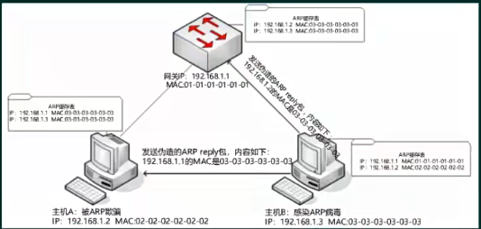

防范：静态绑定

**病毒防治**

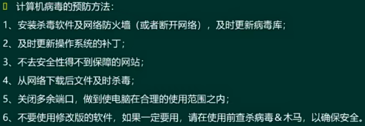

## 加密技术 ⭐⭐⭐

保证机密性，机密性是最基本的。

基本概念：
- 明文
- 密文
- 加密
- 解密
- 加密算法
- 密钥

**对称加密模型**

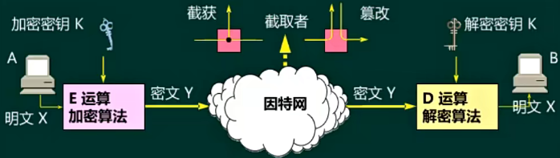

常见对称加密算法：
- DES，用56位加密密钥，产生64位的分组，循环使用置换代换生成最终密文，想要破解只能穷举。
- 3DES，3重DES加密，默认第一次和第三次加密使用的密钥是相同的，密钥长度是112位，若第一次和第三次不同的话， 密钥长度是168位。
- IDEA，密钥长度128位
- AES，高级加密算法，密钥长度至少128位，还有192和256位，加密速度要比3DES要快。

若A和很多其他主机通信，那么密钥就很多，密钥数量越大，管理起来就比较困难，还要确保不能泄露。

缺点：存在密钥管理问题。

优点：加密速度快，适合大数据的加密过程。

**非对称加密模型（公钥加密）**

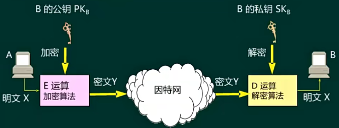

优点：安全性比对称加密要好些，不存在密钥管理和密钥同步问题。

缺点：密钥参数长，加密速度慢。

常见算法：
- RSA
- EIGamal
- ECC
- 背包加密
- Rabin
- D-H
- DSA

## 数字签名和报文摘要 ⭐⭐⭐

**数字签名**

数字签名：基于非对称加密体制，主要功能有：
- 报文鉴别
- 不可否认
- 报文的完整性

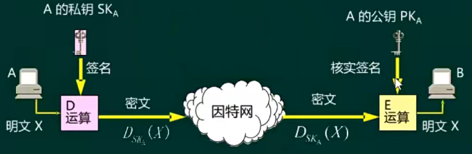

无机密性，任何用户都可以用公钥进行解密，可以保证完整性，别人没有a的私钥，不可篡改消息，也不可抵赖。

由于没有保证机密性，通常都会与加密结合：

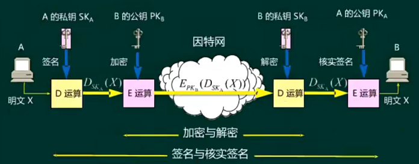

**哈希算法与报文鉴别**

由于数字签名基于非对称加密体制，当报文很大时，加密就很慢，因而有报文摘要运算，只对报文摘要进行签名，可提高整体签名的效率。

哈希算法与数字签名结合可以保证数据的完整性，常见的报文摘要算法如下：
- MD5，产生128位的输出，效率更高
- SHA（安全散列算法）：产生160位的输出，更安全

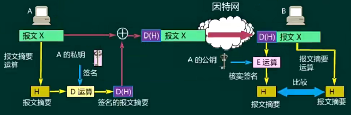

报文摘要运算特点：
- 不管报文有多长，都产生固定长度的输出
- 具有唯一性
- 不可逆性（单向性）

## 密钥的分配 ⭐⭐

**对称密钥的分配**

把对称密钥的分配交给对应的服务器来完成，最常见的就是Kerberos认证服务器，解决密钥管理问题。

Kerberos体系：
- AS，认证服务器
- TGS，票据授权服务器

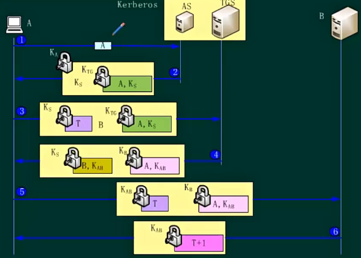

**公钥的认证-数字证书**

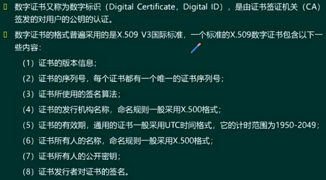

**安全协议-SSL**

其位于应用层和传输层之间的协议。

SSL（安全套接字协议）三大功能：
- SSL服务器鉴别
- 加密的SSL会话
- SSL客户鉴别（可选）

实现三大功能主要是由其子协议完成的：
- 握手子协议（协商加密算法，同步加密密钥等）
- 记录子协议（保证数据传输的机密性和完整性）
- 警告子协议（有任何错误信息，会立即断开会话，清除所有的会话信息）

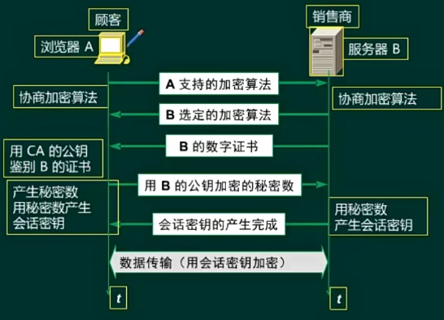

浏览器返回不信任站点：
- 证书是假的
- 浏览器可信任的CA列表中，没有对应的CA，可以手动添加到信任的CA中

还有 TLS（安全传输层协议），是在SSL基础上产生的，是在SSL 3.0版本上的，也可以提供安全的传输，也可以看出SSL的升级版。

**安全协议-SET**

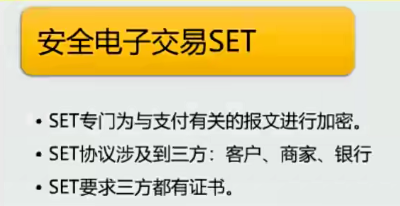

**安全协议-PGP**

安全的电子邮件传输，是应用层协议。

摘要算法通常采用的是MD5。

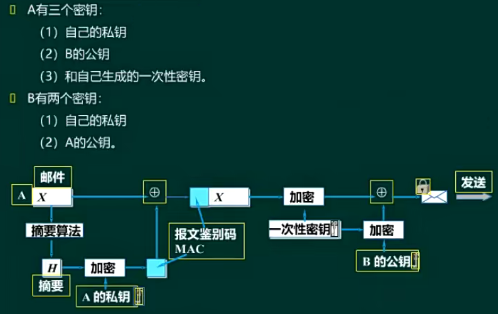

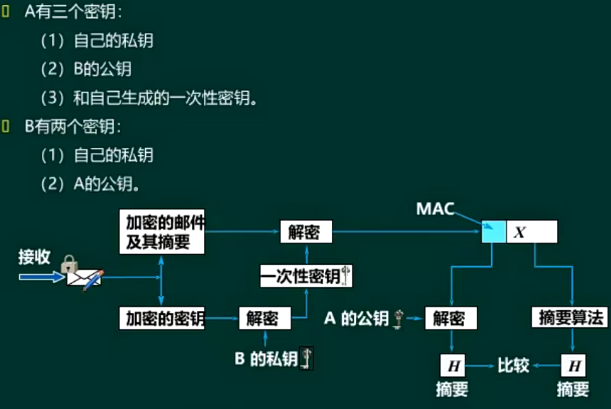

**链路加密**

属于底层的物理层、数据链路层的加密，中间节点被攻破就对整体有危害，安全性并不高。

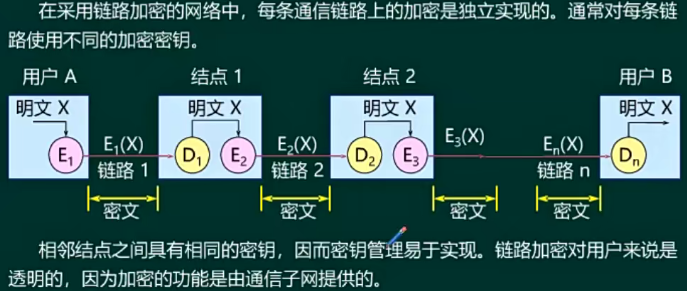

**端到端加密**

高层的加密，一般处理到网络层，报文安全性不受中间节点的影响。

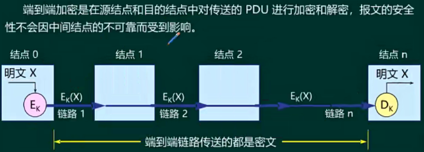

## 防火墙技术 ⭐⭐⭐

**网闸**

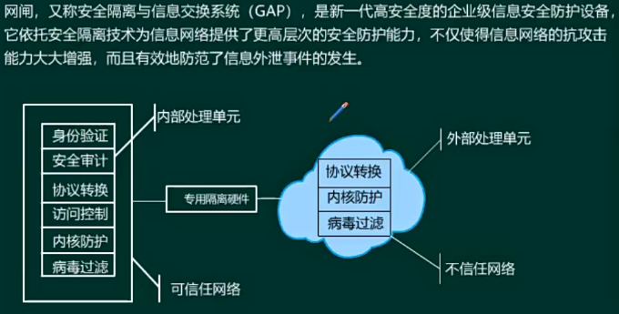

**防火墙技术**

防火墙检测通过的数据包有没有问题，主要是对tcp会话的部分检查，不会对数据内容做检查，在内部网络的边界上。

一般具有访问控制的功能，提供NAT、ACL等功能。

华为防火墙可划分为三个区域，对各区域的安全级别有个默认值（0-100，数字越大，代表可信任程序越高）：
- 信任区（trust，默认值为85），该区域网路受信任程度最高，通常是企业用户所在的内部网络。
- 不信任区（untrust，默认值是5），连接不信任网络，通常是连接外网。
- DMZ区（非军事化区域，默认值为50），受信任程序中等，介于以上两者中间，定义企业内网中需要对外提供服务的服务器，web服务器、ftp服务器等。

华为防火墙上所有的端口默认都是local区域（默认值是100），可以被划分。

**防火墙工作模式-路由模式**

路由模式，可以看成是路由器，各个接口可配置IP，每个接口连接不同的网段，特点是可以提供NAT功能，直接让防火墙完成私有地址到共有地址的转换。

若网络拓扑发生改变，路由模式的防火墙修改要复杂一些，因而适合网络拓扑不怎么变化的结构。

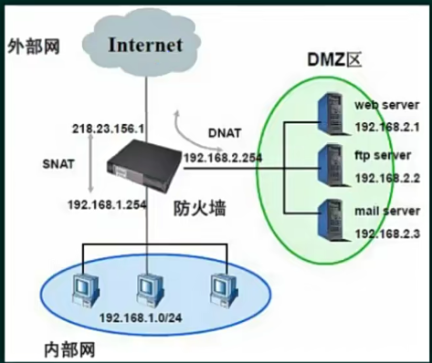

**防火墙工作模式-透明模式**

透明模式下，防火墙类似一个交换机，等同于二层设备，接口没有IP地址，但是所有流量还是经过防火墙，还可以起到过滤效果，对流量做控制，在外部一定要加一个出口路由器，至少要完成NAT的功能。

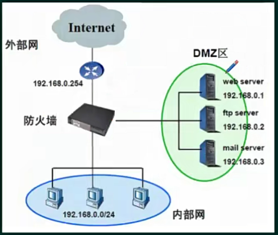

拓扑结构发生变化没有任何影响。

第三种是**混合模式**，前两种模式的结合，某些接口配置IP，默写接口不配置IP。

**防火墙分类**

> 包过滤防火墙

工作在网络层，检查IP包。

优点：成本低，效率高，速度快（因为只检查到网络层，高层不检查）

缺点：
- 只对IP包做检查，没有对上层的数据包进行检查，没有办法过滤上层报文；
- 安全性较低；
- 采用包过滤防火墙，内部主机所有高位端口要开放（因为对外访问时，本地会随机打开一个高位端口通信），会增加安全风险。

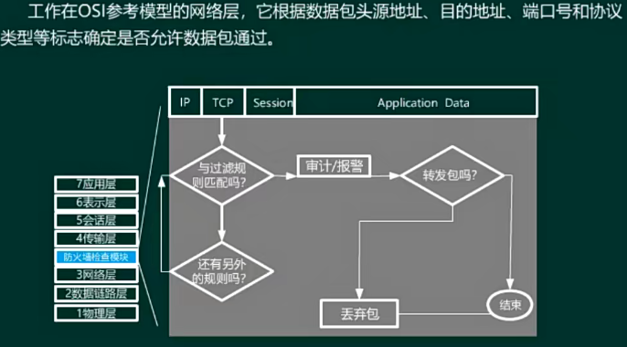

> 代理型防火墙

工作在应用层，提供的安全级别是最高的，速度最慢。

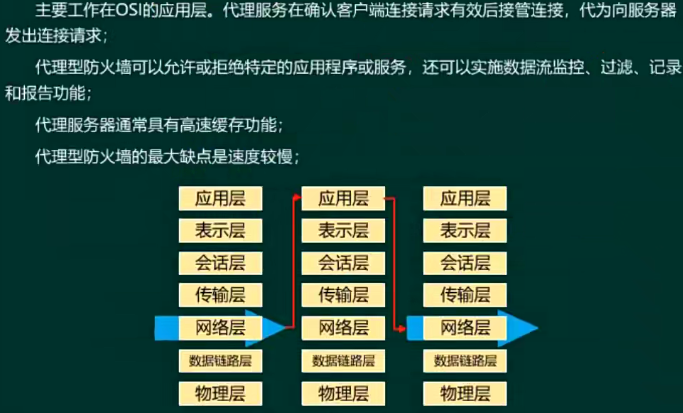

> 状态检测型防火墙

可看成包过滤防火墙的升级版，动态生成连接状态表，效率更高，安全性也更高。

不要求内部主机所有高位端口都开放。

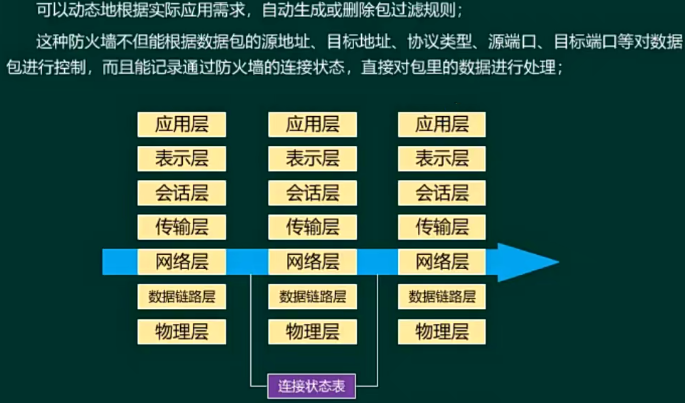

## 入侵检测和入侵防御（IDS和IPS）技术 ⭐⭐⭐

IDS主要是作为防火墙的一个补充，提供一个入侵检测，防火墙主要是防外网攻击，内网用户无法检测，无法抵御内部攻击，IDS可以对内部和外部网络进行攻击检测。

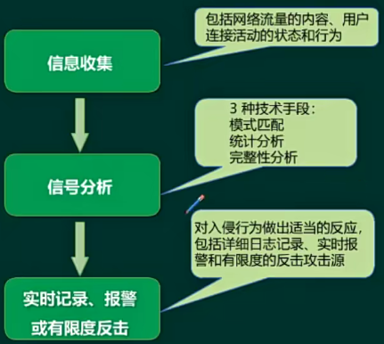

**部署位置**

IDS主要是监控作用，需要监控网络中的流量，挂接在流量经过的链路上，通常是在核心交换机上进行挂接，也叫**旁路监听模式**。交换机一侧的端口为镜像端口，所有流经交换机的流量都会复制一份发送给IDS进行分析。

IDS是发生了入侵行为后进行报警。

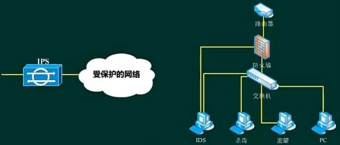

IPS更加主动，可以起到防御的作用，重点在防御上，一般都是串联在受保护网络的前方，主动将入侵行为断掉。

杀毒，对整个网络提供杀毒的功能。

**入侵检测技术分类**

根据数据源分类：
- 基于主机，HIDS
- 基于网络，NIDS
- 分布式，DIDS，分布在网路中不同位置

基于检测方法分类：
- 异常检测，也叫基于行为的检测，系统内部有一个正常的行为数据库，不属于正常的行为都是异常行为。
- 误用检测，也叫基于特征的检测，建立已知攻击行为的特征库，确保特征库丰富且经常更新。