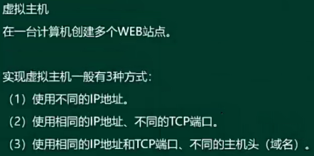
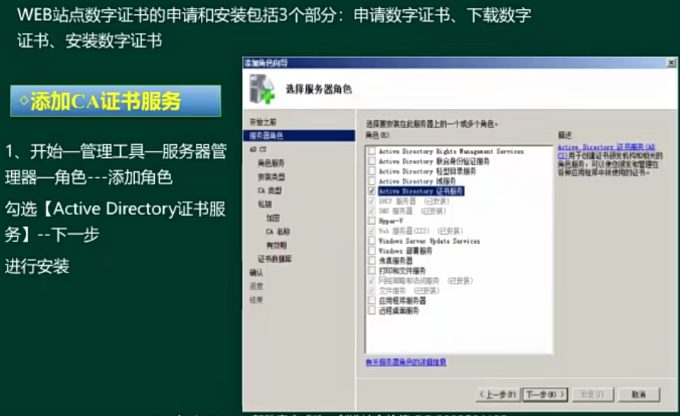
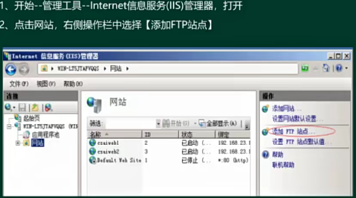
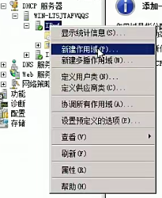

- [服务器配置](#服务器配置)
  - [整体概述](#整体概述)
  - [Windows服务配置](#windows服务配置)
    - [WEB服务器配置 ⭐⭐⭐](#web服务器配置-)
    - [FTP服务器配置 ⭐⭐⭐](#ftp服务器配置-)
    - [DNS服务 ⭐⭐⭐](#dns服务-)
    - [DHCP服务 ⭐⭐⭐](#dhcp服务-)
  - [Linux服务配置](#linux服务配置)
    - [DHCP服务 ⭐⭐⭐](#dhcp服务--1)
    - [DNS服务 ⭐⭐⭐](#dns服务--1)
    - [Samba服务 ⭐⭐⭐](#samba服务-)
    - [FTP服务 ⭐⭐](#ftp服务-)
    - [Apache服务 ⭐⭐](#apache服务-)

# 服务器配置

## 整体概述

windows考试时就考图形界面的显示；考windows server 2018R2版本；

linux考试时考配置文件，配置文件和配置语句，最重要的是dhcp和dns的。

## Windows服务配置

### WEB服务器配置 ⭐⭐⭐

通过安装IIS来提供WEB服务，windows server 2018R2版本中IIS为 7.5；

选择：开始-管理工具-服务器管理器-角色，单击添加角色按钮。

**设置网络限制**

**身份认证的区别**

- Windows身份认证，比较常见的是集成Kerberos认证服务，安全性在这三个中最好。
- 基本身份认证，通过明文的形式传送认证信息，安全级别最低。
- 摘要式身份认证，不会直接传送用户账号密码信息，通过md5方式传送，安全级别居中。

**IP地址和域限制**

**虚拟目录**

就是一个单独的url，在单独的一个文件夹，方便管理。

选择一个网站，鼠标右键选择添加虚拟目录：

**虚拟主机**

**数字证书**

申请完成后，在web站点上，要配置网站绑定https，选择证书；同时还要在SSL设置中勾选要求SSL并应用。

### FTP服务器配置 ⭐⭐⭐

IIS 7.5包含ftp服务器，所以安装IIS即可。

**添加ftp站点**

**命令行方式访问ftp**

### DNS服务 ⭐⭐⭐

**安装**

都是本地服务的DNS，一般分为两个区域，正向区域和反向区域，正向就是域名到IP。

**配置正向区域**

主要是A记录、CNAME别名记录和MX邮件记录。

**配置反向查找区域**

主要是创建PTR反向查找记录。

### DHCP服务 ⭐⭐⭐

实现IP地址的自动分配。

**安装**

**配置**

主要就是新建作用域，也就是地址池。

给客户端配置默认的网关等。

**设置DHCP中继**

需要安装路由和远程访问服务（网络策略和访问服务）。

配置DHCP中继代理

## Linux服务配置

### DHCP服务 ⭐⭐⭐

**配置文件解析**

默认配置文件 `/etc/dhcpd.conf`

可配可不配：

subnet ... （指明DHCP的作用域）

host ... （为特定的客户端指定地址）

> dhcpd.leases文件

> 启动服务

service dhcpd (start | stop | restart)

### DNS服务 ⭐⭐⭐

**DNS 客户机配置**

**DNS 服务器配置**

DNS 服务程序称为BIND程序。

主配置文件/etc/named.conf。

. 代表根区域。
file 后代表区域配置文件。

**正向区域文件**

server.csai.cn是权威域名服务器。

图中的5代表优先级，越小越优先。

**反向区域文件**

PTR记录比较重要。

**配置DNS负载均衡**

启动DNS服务：

service named (start | stop | restart)

### Samba服务 ⭐⭐⭐

主要是实现不同操作的文件和打印资源共享功能。

主要配置文件：/etc/samba/smb.conf

还有smbclient客户端程序。

security中的配置：
- share安全级别最低，不需要任何验证，实现资源共享
- user，客户端访问时，需要输入服务器中配置的用户和密码
- Server，也是需要输入用户密码验证，不过是单独的一个认证服务器来验证
- Domain，由域当中的域服务器来进行身份认证，安全级别最高

Valid users中加@符号指的是用户组。

用户管理配置

service smb (start | stop | restart)

### FTP服务 ⭐⭐

linux中使用的是vsftp服务，主配置文件为/etc/vsftpd/vsftpd.conf

上述配置为用户的黑白名单。

service vsftpd (start | stop | restart)

### Apache服务 ⭐⭐

linux中使用apache web服务。

主配置文件为 /etc/httpd/conf/httpd.conf

apache的web默认路径为/var/www/html

Timeout 默认值为120s

service httpd (start | stop | restart)