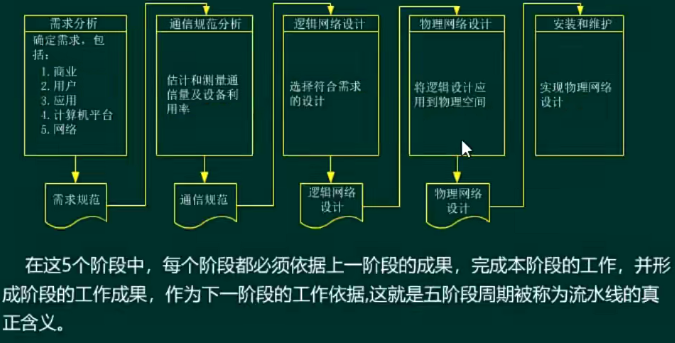
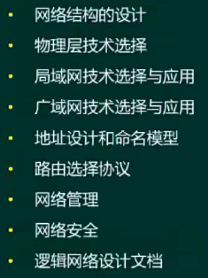
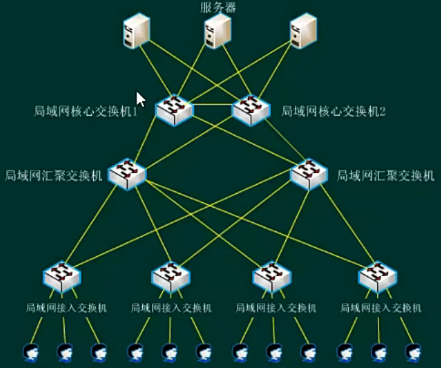

# 网络规划与设计 ⭐⭐⭐

> 网络系统建设

> 逻辑网络设计

一般划分为三个层次：
- 核心层（要求快速转发，冗余设计）
  - 设备性能最高
- 汇聚层（网络拓扑简单时，可没有这一层次）
  - 承上启下作用，网络比较复杂，一定要有汇聚设备
  - 通常汇聚层也会做冗余
  - ACL、路由、流量过滤等，都在这一层次配置
- 接入层
  - 因为用户终端类型多，接口类型要有多种
  - 提供一些接入认证功能、用户计费、用户信息收集等

IP设计原则：
- 唯一性
- 连续性，为了更好的实现路由汇聚
- 实意性
- 可扩展性

> 物理网络设计

