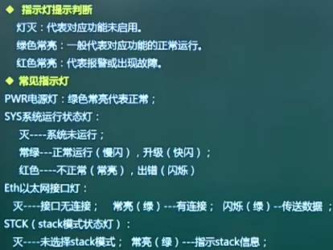
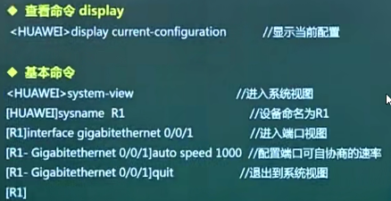
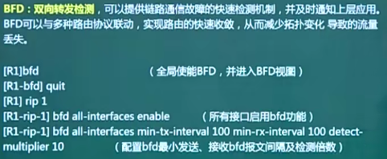
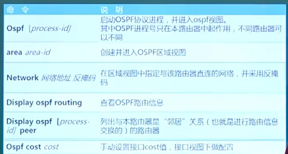
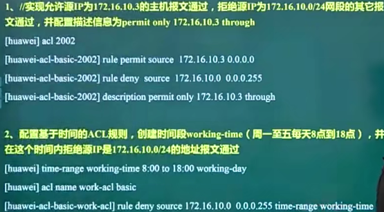
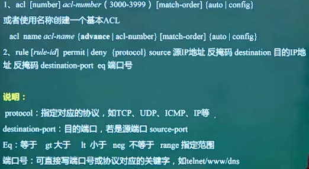

- [网络设备配置](#网络设备配置)
  - [整体概述](#整体概述)
  - [交换机设备](#交换机设备)
    - [网络设备的基本配置 ⭐⭐⭐](#网络设备的基本配置-)
    - [VLAN配置 ⭐⭐⭐](#vlan配置-)
    - [GARP配置 ⭐⭐⭐](#garp配置-)
    - [STP配置 ⭐⭐](#stp配置-)
  - [路由器设备](#路由器设备)
    - [DHCP 服务器配置 ⭐⭐⭐](#dhcp-服务器配置-)
    - [静态路由配置 ⭐⭐⭐](#静态路由配置-)
    - [动态路由配置 ⭐⭐⭐](#动态路由配置-)
      - [RIP路由 ⭐⭐⭐](#rip路由-)
      - [OSPF路由 ⭐⭐⭐](#ospf路由-)
      - [IS-IS](#is-is)
      - [路由重发布](#路由重发布)
      - [BGP路由 ⭐⭐](#bgp路由-)
      - [虚拟路由冗余协议 VRRP](#虚拟路由冗余协议-vrrp)
  - [ACL-NAT](#acl-nat)
    - [访问控制列表 ACL ⭐⭐⭐](#访问控制列表-acl-)
    - [网络地址转换 NAT ⭐⭐](#网络地址转换-nat-)
  - [VPN技术](#vpn技术)

# 网络设备配置

## 整体概述

终点掌握交换机和路由器的配置。

## 交换机设备

### 网络设备的基本配置 ⭐⭐⭐

网络设备的操作系统，目前考试以华为为主：
- 华为网络设备，VRP（Versatile Routing Platform通用路由平台，常用两个版本VRP5和VRP8）
- Cisco思科设备，IOS（Internetwork Operating System）

常见的设备配置方式：

通过console方式连接时，注意**数据速率是9600 bit/s**。

网络设备的内存类型：
- ROM，只读存储器，存放设备启动时依赖的程序；
- Flash，存放操作系统；
- RAM，可读可写，掉电会丢失，存放设备运行时需要的数据，运行中的设备配置文件存储在这；
- NVRAM，非易失性随机存储器，也会掉电丢失，保存之后的配置文件，启动时加载的配置存放在这。

配置文件：
- 运行配置
  - current-configuration（华为）
  - running-config（思科）
- 启动配置（保存的配置）
  - saved-configuration（华为）
  - startup-config（思科）

保存配置文件到启动配置：
- save（华为）
- copy running-config startup-config 或 write（思科）

**命令视图（华为）**

Vty是虚拟线路，用于远程登录，最多有16条（编号为0-15），一般用5条（0-4）。

**常见指示灯**

**华为设备-基本命令**

aaa是一种安全体系，可以提供认证、授权和统计计费三大功能一体。

权限privilege 最高级别是15，远程用户可执行任何操作，权限越低，可执行命令越少。

**华为交换机配置**

二层的端口隔离，可实现同一个Vlan中的二层数据隔离，可在安全方面起作用。

三层隔离是配置port-isolate mode all

### VLAN配置 ⭐⭐⭐

trunk和hybrid区别：
- trunk端口多用于交换机和交换机连接；除了本地vlan，其他所有vlan都是带标签的；
- hybrid可用于交换机间连接，也可连接终端；可设置vlan是否带标签；

### GARP配置 ⭐⭐⭐

注意不同的注册模式的区别。

### STP配置 ⭐⭐

在交换机上破除环路。

## 路由器设备

### DHCP 服务器配置 ⭐⭐⭐

在地址池中排除指定ip，使用`excluded ipaddress`

静态绑定某主机ip地址，使用`static-bind ipaddress macaddress`

### 静态路由配置 ⭐⭐⭐

**路由技术基础**

- 要知道目的地址
- 有学习到路由的资源
- 有可以到达目的网络的路径
- 在众多路径中有最佳的选择
- 管理和维护路由信息

**静态路由配置**

### 动态路由配置 ⭐⭐⭐

**路由协议分类**

在一个自治系统AS内部会运行相同的动态路由协议，自治系统之间通过外部网关协议进行交互。

路由协议分类：
- 距离矢量路由协议（**RIP**、IGRP）
  - **传播整个路由表**信息来完成路由信息扩散学习
  - 通过跳数来衡量路由好坏
  - 适合小网络
  - 属于内部路由协议
- 链路状态路由协议（OSPF、IS-IS）
  - 传送的是链路状态信息，收敛效果比距离矢量的要好
  - 适合大型网络
  - 属于内部路由协议
- 平衡混合路由协议（BGP）
  - 结合了前面两个的优点，在不同网络之前传播路由信息

**路由选择基本概念**

- 邻居关系，一个路由器和另一个路由器直接相连的，是邻居关系。
- 优先级，路由协议的优先级。
  - 华为路由协议的优先级（优先级越小，越优）：
    - 直连路由：0
    - OSPF：10
    - IS-IS：15
    - 静态路由：60
    - RIP：100
    - BGP：255
- 度量值，比较相同路由协议学习到的路由条目的开销：
  - RIP主要参考的就是跳数
  - OSPF主要参考的是带宽，带宽越大，开销越小
  - 因而OSPF相对来说更可靠

#### RIP路由 ⭐⭐⭐

**协议特点**
- 仅和相邻路由器交换信息
- 交换的信息是当前本路由器所知道的全部信息（整个路由表）
- 按固定的时间间隔交换路由信息，默认30s
- 在传输层使用UDP，端口为520，来广播发送路由信息
- 网络比较大时，收敛时间长，效率低，会有路由环路故障概率
- 最大跳数为15

**工作原理**

**解决路由环路方法**
- 最大度量值，设置最大跳数16为不可达路由，需要一定时间。
- 水平分割
- 路由下毒，检测到down后，设置为16最大跳数
- 反向下毒
- 保持时间
- 触发更新

**RIP计时器**
- 路由更新计时30s
- 路由无效计时180s
- 保持计时器180s
- 路由清理时间240s

**命令配置**

和BFD联动：

**RIP版本**

#### OSPF路由 ⭐⭐⭐

**概述**

整个网路中各个邻居路由器间交互的是网络的链路状态，每台路由器都有整个网络的链路状态数据库，每个路由器都会采用SFP（最短路径有限）算法计算最佳路由。

和RIP比较：
- OSPF对整个网路的拓扑非常的了解，RIP并不了解
- 计算最佳路由算法不同
- RIP路由每30s一更新，OSPF则是链路状态变化后触发更新。

**工作过程**

- 寻找邻居
  - 周期性广播发送HELLO报文给邻居路由器，发现有效邻居
  - OSFP区域内唯一标识路由器的IP地址，称为Route ID
  - Route ID选取规则：
    - 通过route-id 命令指定Route ID
    - 选取路由器loopback接口上数值最高的IP地址
    - 若没有loopback接口，在物理端口中选取IP地址最高的
- 建立邻接关系
  - 只有邻接关系的路由器之间才会交互链路状态信息
  - 点对点网络的邻居路由器也将建立邻接关系

  - DR和BDR选举过程，优先级最高的是DR，次最高的是BDR

- 链路状态信息传递
  - OSPF五种分组类型：
  - 
- 计算路由

将**OSPF进行区域的划分**，一个区域内部的路由器只要和内部的路由器交换链路状态即可，其他区域的路由器则不用理会。好处就是一个区域内部的链路状态数据库比较小，执行链路计算时比较快。

默认所有路由器都在Aera 0中，一个区域内部的路由器称为内部路由器。即使有多个区域，也都属于一个自治系统AS。若有多个区域，在边界上的路由器称为区域边界路由器ABR。和其他自治系统连接的路由器称为自治系统边界路由器ASBR。

**OSPF基本配置**

掩码是网络位为1，主机位为0信息；
反掩码是网络位为0，主机位为1的信息。

配置案例：

#### IS-IS

中间系统到中间系统 IS-IS，更多是应用在运营商网路中，OSPF更多用在企业网络中。

协议特点：

配置命令：

level-1（l1）属于普通区域、level1-2（l1/2）可以处于骨干区域和普通区域的路由器，类似区域边界路由器、level-2（l2）属于骨干区域。

#### 路由重发布

边界路由器运行了RIP和OSPF协议，通过进程号区分。两个网络默认不会交互路由信息，会有网络连通性问题。需要在边界路由器上进行配置路由重发布，使得两边可双向发布路由信息。

#### BGP路由 ⭐⭐

BGP协议特点：

在传输层对应的是TCP协议。

配置举例：

ip address 172.16.60.1 255.255.255.0

#### 虚拟路由冗余协议 VRRP

等同于思科的HSRP，多台设备冗余成一个VRRP组，对外虚拟成一台设备。

配置：
- 配置VRRP的虚拟网关
- 配置VRRP的优先级

配置举例：

## ACL-NAT 

### 访问控制列表 ACL ⭐⭐⭐

通常部署在路由器、交换机上，应用在某一个接口的某一个方向的。

基于数据包过滤技术，来进行匹配，匹配顺序是指令列表从上往下匹配。若一直没有匹配，思科默认有一条拒绝所有的隐含语句。

**ACL分类**

- 基本ACL配置（华为）

案例：

工作日是working-day，休息日或周末是off-day，每天就是daily，其他时间就是星期几的英文单词。

- 高级ACL配置（华为）

案例：

最后默认会有一条rule deny all拒绝所有的指令。

**基于ACL的报文过滤（华为）**

**基于ACL的简化流策略（华为）**

**扩展-防火墙上应用ACL（华为）**

### 网络地址转换 NAT ⭐⭐

- 静态NAT

对公有地址消耗比较大。

- 动态NAT

实现了地址的复用；

Basic NAT仍然是一对一的使用，除非被释放，否则不能给另一个使用；NAPT实现了多对一的映射，多个私有地址映射为1个共有地址，通过端口号来区分私有地址。

主要讲的是NAPT，ACL可以控制哪些地址可以进行NAT转换访问外网。

若不想使用NAPT时，可在最后加上 no-pat 使用一对一的动态NAT。

## VPN技术

物理专用网也就是专线，虚拟专用网在互联网中使用。

分类：
- PPTP VPN
  - 工作在二层的虚拟链路技术，结合的是PPP协议，是微软开的的协议，windows平台都包含这个功能，安全方面都是PPP协议提供的，安全性不是特别好。
- L2TP VPN
  - 也是工作在二层的VPN技术，是一个国际标准协议，任何主机都可以支持，除了windows，其他可以用这个技术来实现。
- MPLS VPN
  - 多协议标记交换技术，通过标记的形式进行数据的快速转发，可以看成独立于二层和三层的技术，在二层或三层实现都可以。
- IPsec VPN
  - IPsec协议和VPN技术的结合，可为VPN技术提供安全方面的保障，主要针对IP数据包来提供VPN技术，工作在第三层。
- GRE VPN
  - GRE是封装协议，会封装出一条隧道，在原本数据包中增加一个头部，相当于通信隧道。
- SSL VPN
  - 工作在应用层的VPN技术，支持浏览器的客户端都可以支持SSL VPN，配置比IPsec VPN要简单。

**IPsec VPN**

AH：认证头协议，提供认证功能，对整个数据包认证，添加认证头在在数据包中，通过哈希算法实现。

ESP：安全的载荷，提供数据传输的机密性，通过加密算法实现。

密钥管理协议：IKE，确保密钥在交换过程中安全性。

**传输模式：**

**隧道模式：**

一般是在出口路由器上配置。

**配置（华为）**

